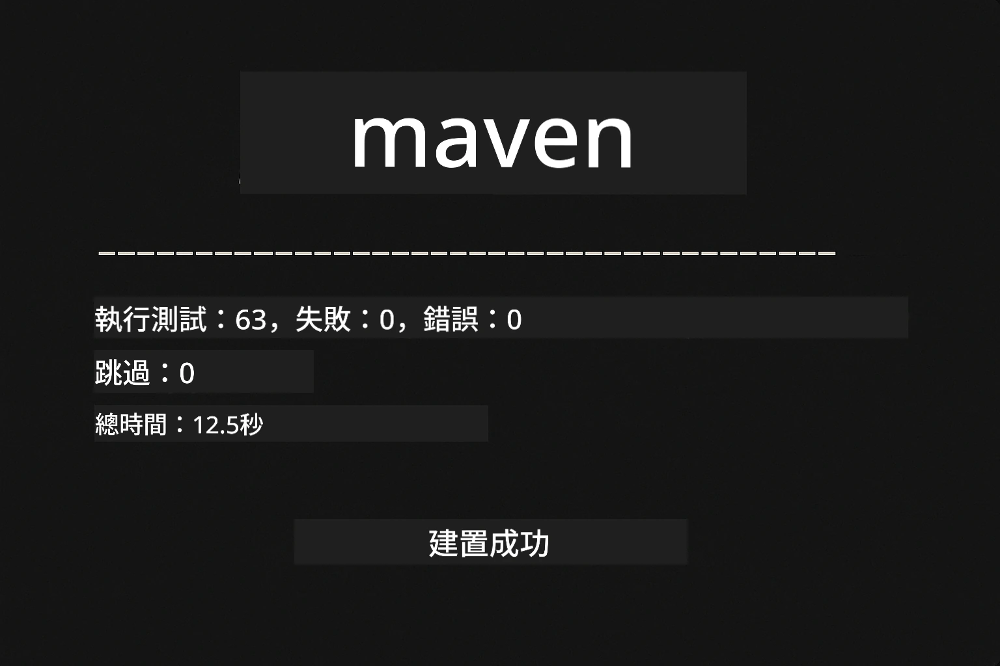
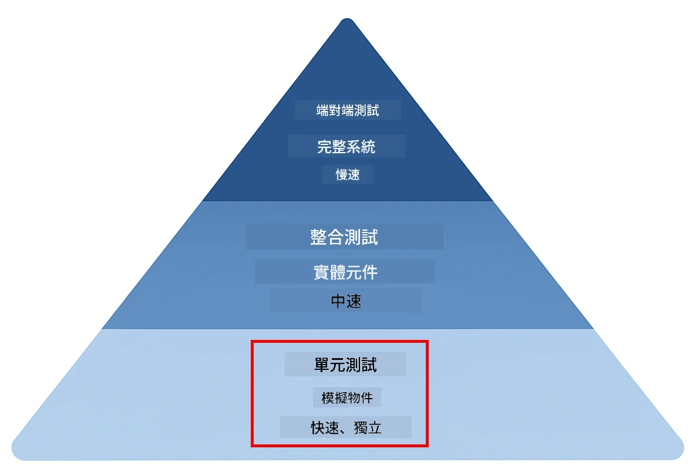
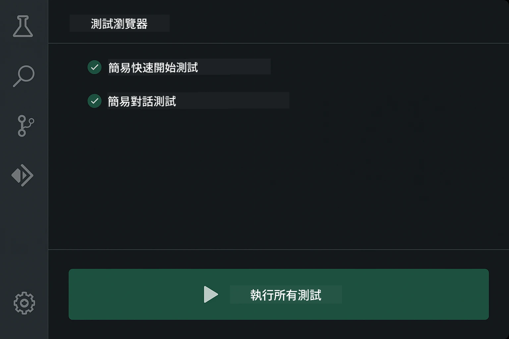
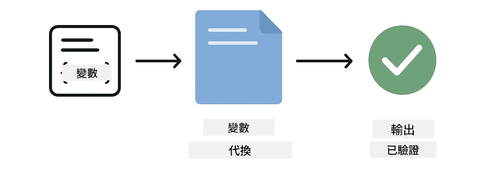
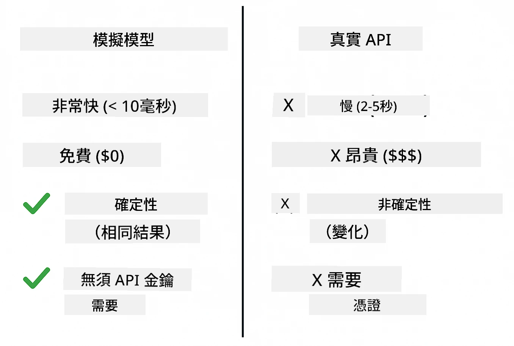
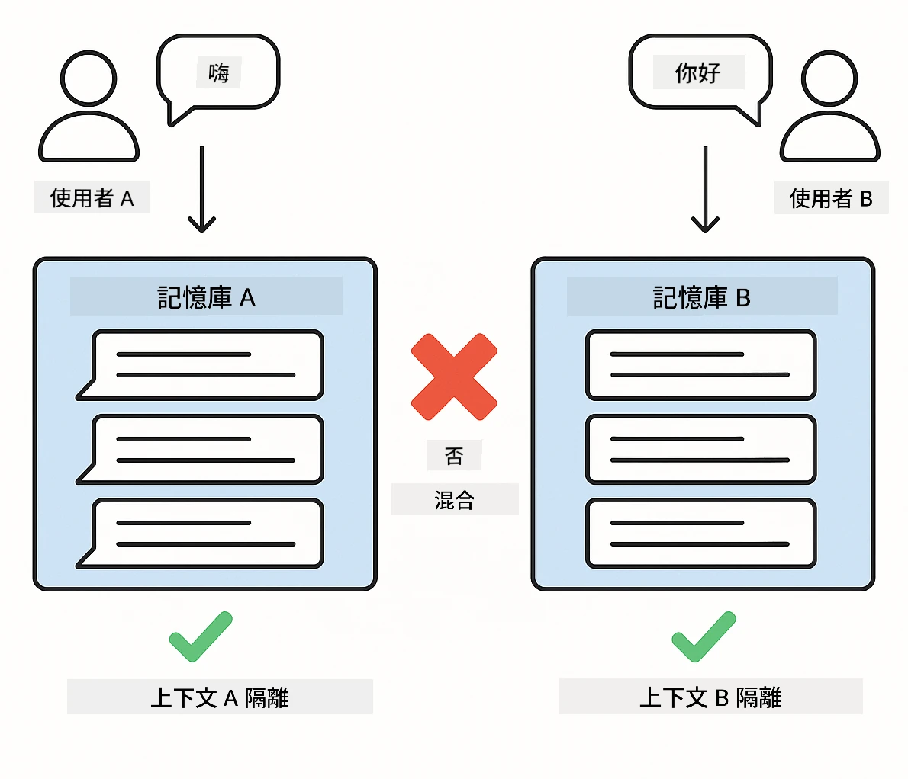
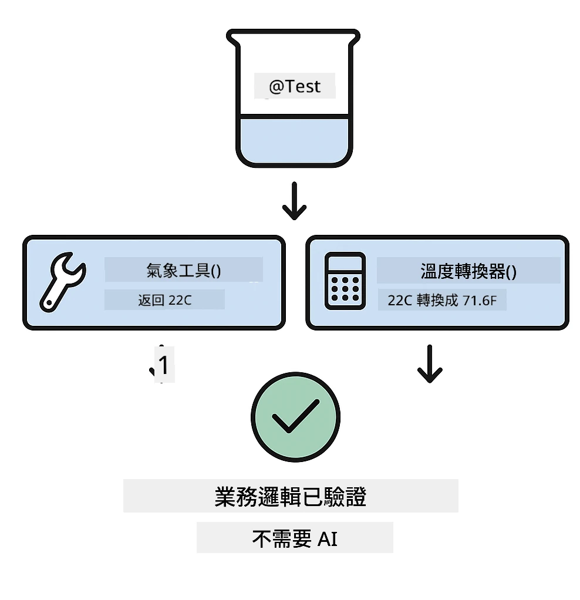
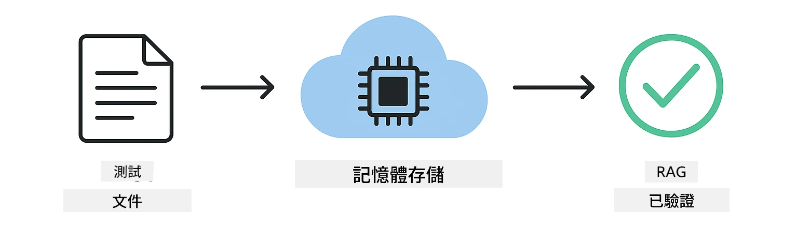

# 測試 LangChain4j 應用程式

## 目錄

- [快速開始](#快速開始)
- [測試涵蓋範圍](#測試涵蓋範圍)
- [執行測試](#執行測試)
- [在 VS Code 中執行測試](#在-vs-code-中執行測試)
- [測試模式](#測試模式)
- [測試理念](#測試理念)
- [後續步驟](#後續步驟)

本指南引導您了解如何測試 AI 應用程式，而不需要 API 金鑰或外部服務。

## 快速開始

使用單一指令執行所有測試：

**Bash:**
```bash
mvn test
```

**PowerShell:**
```powershell
mvn --% test
```

當所有測試通過時，您會看到類似下圖的輸出 — 測試全數成功且無錯誤。



*成功執行測試，所有測試皆通過且無錯誤*

## 測試涵蓋範圍

本課程專注於在本地執行的 <strong>單元測試</strong>。每個測試分別展示 LangChain4j 的特定概念。下方的測試金字塔展示單元測試的位置 — 它是快速且可靠的基礎，也是整體測試策略的根基。



*測試金字塔展示單元測試（快速、獨立）、整合測試（實體元件）及端對端測試的平衡。本教程涵蓋單元測試。*

| 模組 | 測試數量 | 重點 | 主要檔案 |
|--------|-------|-------|-----------|
| **01 - 介紹** | 8 | 對話記憶與狀態對話 | `SimpleConversationTest.java` |
| **02 - 提示工程** | 12 | GPT-5.2 範例、急迫度、結構化輸出 | `SimpleGpt5PromptTest.java` |
| **03 - RAG** | 10 | 文件攝取、嵌入、相似度搜尋 | `DocumentServiceTest.java` |
| **04 - 工具** | 12 | 函式呼叫與工具串接 | `SimpleToolsTest.java` |
| **05 - MCP** | 8 | 使用 Stdio 傳輸的模型上下文協定 | `SimpleMcpTest.java` |

## 執行測試

**從根目錄執行所有測試：**

**Bash:**
```bash
mvn test
```

**PowerShell:**
```powershell
mvn --% test
```

**執行特定模組的測試：**

**Bash:**
```bash
cd 01-introduction && mvn test
# 或者從根目錄開始
mvn test -pl 01-introduction
```

**PowerShell:**
```powershell
cd 01-introduction; mvn --% test
# 或從根目錄
mvn --% test -pl 01-introduction
```

**執行單一測試類別：**

**Bash:**
```bash
mvn test -Dtest=SimpleConversationTest
```

**PowerShell:**
```powershell
mvn --% test -Dtest=SimpleConversationTest
```

**執行特定測試方法：**

**Bash:**
```bash
mvn test -Dtest=SimpleConversationTest#應該維持對話歷史
```

**PowerShell:**
```powershell
mvn --% test -Dtest=SimpleConversationTest#應該維持對話歷史
```

## 在 VS Code 中執行測試

若您使用 Visual Studio Code，測試探索器能提供圖形化介面用於執行及除錯測試。



*VS Code 測試探索器展示完整的 Java 測試類別與各個測試方法的樹狀結構*

**在 VS Code 執行測試的方法：**

1. 點擊活動列上的燒杯圖示開啟測試探索器
2. 展開測試樹以檢視所有模組和測試類別
3. 點擊任一測試旁的播放按鈕，執行該測試
4. 點擊「Run All Tests」執行全部測試
5. 右鍵點擊測試選擇「Debug Test」設置斷點並逐步執行

測試探索器會以綠色勾號標示通過測試，失敗時會提供詳細錯誤訊息。

## 測試模式

### 模式 1：測試提示模板

最簡單的模式是測試提示模板，並不會呼叫任何 AI 模型。目的是驗證變數的替換是否正確，以及提示格式是否如預期。



*測試提示模板示意變數替換流程：帶有佔位符的模板 → 套用值 → 驗證格式化輸出*

```java
@Test
@DisplayName("Should format prompt template with variables")
void testPromptTemplateFormatting() {
    PromptTemplate template = PromptTemplate.from(
        "Best time to visit {{destination}} for {{activity}}?"
    );
    
    Prompt prompt = template.apply(Map.of(
        "destination", "Paris",
        "activity", "sightseeing"
    ));
    
    assertThat(prompt.text()).isEqualTo("Best time to visit Paris for sightseeing?");
}
```

此模式驗證變數替換功能正常，提示格式符合預期 — 不需 API 金鑰或模型呼叫。

### 模式 2：模擬語言模型

測試對話邏輯時，可使用 Mockito 建立假模型，回傳預設的回應。這使測試快速、免費且具決定性。



*比較示意說明為何模擬測試首選：它快速、免費、具決定性，且無須 API 金鑰*

```java
@ExtendWith(MockitoExtension.class)
class SimpleConversationTest {
    
    private ConversationService conversationService;
    
    @Mock
    private OpenAiOfficialChatModel mockChatModel;
    
    @BeforeEach
    void setUp() {
        ChatResponse mockResponse = ChatResponse.builder()
            .aiMessage(AiMessage.from("This is a test response"))
            .build();
        when(mockChatModel.chat(anyList())).thenReturn(mockResponse);
        
        conversationService = new ConversationService(mockChatModel);
    }
    
    @Test
    void shouldMaintainConversationHistory() {
        String conversationId = conversationService.startConversation();
        
        ChatResponse mockResponse1 = ChatResponse.builder()
            .aiMessage(AiMessage.from("Response 1"))
            .build();
        ChatResponse mockResponse2 = ChatResponse.builder()
            .aiMessage(AiMessage.from("Response 2"))
            .build();
        ChatResponse mockResponse3 = ChatResponse.builder()
            .aiMessage(AiMessage.from("Response 3"))
            .build();
        
        when(mockChatModel.chat(anyList()))
            .thenReturn(mockResponse1)
            .thenReturn(mockResponse2)
            .thenReturn(mockResponse3);

        conversationService.chat(conversationId, "First message");
        conversationService.chat(conversationId, "Second message");
        conversationService.chat(conversationId, "Third message");

        List<ChatMessage> history = conversationService.getHistory(conversationId);
        assertThat(history).hasSize(6); // 3 個使用者 + 3 個 AI 訊息
    }
}
```

此模式出現在 `01-introduction/src/test/java/com/example/langchain4j/service/SimpleConversationTest.java` 中。此模擬確保行為穩定，方便驗證記憶管理是否正確。

### 模式 3：測試對話隔離

對話記憶需區分多個使用者。此測試用以驗證對話不會混合上下文。



*測試對話隔離，顯示不同使用者有獨立記憶，防止上下文混淆*

```java
@Test
void shouldIsolateConversationsByid() {
    String conv1 = conversationService.startConversation();
    String conv2 = conversationService.startConversation();
    
    ChatResponse mockResponse = ChatResponse.builder()
        .aiMessage(AiMessage.from("Response"))
        .build();
    when(mockChatModel.chat(anyList())).thenReturn(mockResponse);

    conversationService.chat(conv1, "Message for conversation 1");
    conversationService.chat(conv2, "Message for conversation 2");

    List<ChatMessage> history1 = conversationService.getHistory(conv1);
    List<ChatMessage> history2 = conversationService.getHistory(conv2);
    
    assertThat(history1).hasSize(2);
    assertThat(history2).hasSize(2);
}
```

每個對話維持獨立歷史。在生產系統中，此隔離對於多用戶應用至關重要。

### 模式 4：獨立測試工具

工具是 AI 可以呼叫的函式。直接測試工具可確保功能正確，無論 AI 判斷如何。



*獨立測試工具示意，使用模擬工具執行而非 AI 呼叫，以驗證商業邏輯*

```java
@Test
void shouldConvertCelsiusToFahrenheit() {
    TemperatureTool tempTool = new TemperatureTool();
    String result = tempTool.celsiusToFahrenheit(25.0);
    assertThat(result).containsPattern("77[.,]0°F");
}

@Test
void shouldDemonstrateToolChaining() {
    WeatherTool weatherTool = new WeatherTool();
    TemperatureTool tempTool = new TemperatureTool();

    String weatherResult = weatherTool.getCurrentWeather("Seattle");
    assertThat(weatherResult).containsPattern("\\d+°C");

    String conversionResult = tempTool.celsiusToFahrenheit(22.0);
    assertThat(conversionResult).containsPattern("71[.,]6°F");
}
```

此測試來自 `04-tools/src/test/java/com/example/langchain4j/agents/tools/SimpleToolsTest.java`，驗證未透過 AI 的工具邏輯。串接範例展現一個工具的輸出如何成為另一工具的輸入。

### 模式 5：記憶中 RAG 測試

傳統 RAG 系統須依賴向量資料庫與嵌入服務。記憶中測試模式可於不依賴外部資源下測試完整管線。



*記憶中 RAG 測試流程示意，涵蓋文件解析、嵌入儲存與相似度搜尋，無須資料庫*

```java
@Test
void testProcessTextDocument() {
    String content = "This is a test document.\nIt has multiple lines.";
    InputStream inputStream = new ByteArrayInputStream(content.getBytes(StandardCharsets.UTF_8));
    
    DocumentService.ProcessedDocument result = 
        documentService.processDocument(inputStream, "test.txt");

    assertNotNull(result);
    assertTrue(result.segments().size() > 0);
    assertEquals("test.txt", result.segments().get(0).metadata().getString("filename"));
}
```

此測試出自 `03-rag/src/test/java/com/example/langchain4j/rag/service/DocumentServiceTest.java`，在記憶中建立文件並驗證切塊與元資料處理。

### 模式 6：MCP 整合測試

MCP 模組測試使用 stdio 傳輸的模型上下文協定整合。測試驗證應用程式是否能以子程序形式啟動與通信 MCP 伺服器。

`05-mcp/src/test/java/com/example/langchain4j/mcp/SimpleMcpTest.java` 中的測試驗證 MCP 用戶端行為。

**執行方式：**

**Bash:**
```bash
cd 05-mcp && mvn test
```

**PowerShell:**
```powershell
cd 05-mcp; mvn --% test
```

## 測試理念

測試的是您的程式碼，而不是 AI。您的測試應驗證您所寫的程式：確認提示模板如何建構、記憶如何管理以及工具如何執行。AI 回應有變化，不宜作為斷言依據。關注提示模板是否正確替換變數，而非 AI 是否給出正確答案。

對語言模型使用模擬。它們是外部依賴，速度慢、成本高且結果不具決定性。模擬讓測試快速（毫秒級而非秒）、免費且結果一致。

保持測試獨立。每個測試應單獨準備資料，不依賴其他測試，且測試後能清理環境。測試順序不同時都應通過。

涵蓋邊界情況，不只測試理想情境。嘗試空輸入、極大輸入、特殊字元、無效參數與界限條件。這些經常揭露平常使用看不見的錯誤。

使用描述性命名。比較 `shouldMaintainConversationHistoryAcrossMultipleMessages()` 與 `test1()`。前者明確告訴您測試目標，讓錯誤除錯更容易。

## 後續步驟

既然您已理解測試模式，接著深入研究各模組：

- **[01 - 介紹](../01-introduction/README.md)** - 學習對話記憶管理
- **[02 - 提示工程](../02/prompt-engineering/README.md)** - 掌握 GPT-5.2 提示範例
- **[03 - RAG](../03-rag/README.md)** - 建置檢索增強生成系統
- **[04 - 工具](../04-tools/README.md)** - 實作函式呼叫與工具串接
- **[05 - MCP](../05-mcp/README.md)** - 整合模型上下文協定

每個模組的 README 提供此處測試概念的詳細說明。

---

**導航：** [← 返回主頁](../README.md)

---

<!-- CO-OP TRANSLATOR DISCLAIMER START -->
**免責聲明**：
此文件已使用 AI 翻譯服務 [Co-op Translator](https://github.com/Azure/co-op-translator) 進行翻譯。雖然我們努力追求準確性，但請注意自動翻譯可能包含錯誤或不準確之處。原始文件的母語版本應視為權威來源。對於關鍵資訊，建議採用專業人工翻譯。我們不對因使用此翻譯所產生的任何誤解或誤譯承擔責任。
<!-- CO-OP TRANSLATOR DISCLAIMER END -->