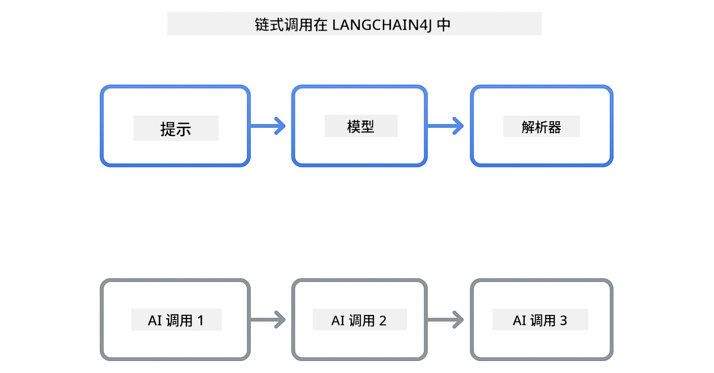
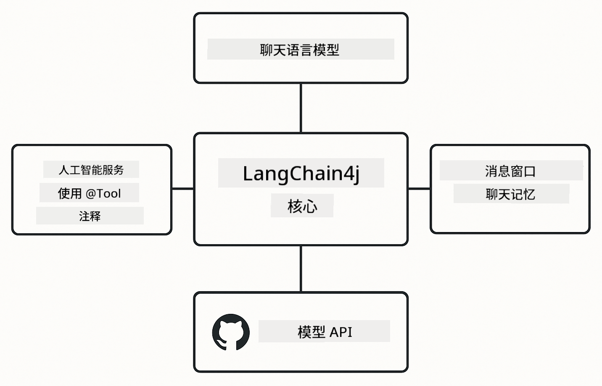

<!--
CO_OP_TRANSLATOR_METADATA:
{
  "original_hash": "22b5d7c8d7585325e38b37fd29eafe25",
  "translation_date": "2026-01-05T21:52:00+00:00",
  "source_file": "00-quick-start/README.md",
  "language_code": "zh"
}
-->
# Module 00: 快速开始

## 目录

- [介绍](../../../00-quick-start)
- [什么是 LangChain4j？](../../../00-quick-start)
- [LangChain4j 依赖](../../../00-quick-start)
- [先决条件](../../../00-quick-start)
- [设置](../../../00-quick-start)
  - [1. 获取你的 GitHub 令牌](../../../00-quick-start)
  - [2. 设置你的令牌](../../../00-quick-start)
- [运行示例](../../../00-quick-start)
  - [1. 基础聊天](../../../00-quick-start)
  - [2. 提示模式](../../../00-quick-start)
  - [3. 函数调用](../../../00-quick-start)
  - [4. 文档问答（RAG）](../../../00-quick-start)
  - [5. 负责任的 AI](../../../00-quick-start)
- [每个示例展示了什么](../../../00-quick-start)
- [下一步](../../../00-quick-start)
- [故障排除](../../../00-quick-start)

## 介绍

本快速入门旨在帮助你尽快使用 LangChain4j 启动并运行。它涵盖了使用 LangChain4j 和 GitHub Models 构建 AI 应用的绝对基础知识。在后续模块中，你将使用 Azure OpenAI 和 LangChain4j 构建更高级的应用。

## 什么是 LangChain4j？

LangChain4j 是一个简化构建 AI 驱动应用的 Java 库。不必处理 HTTP 客户端和 JSON 解析，你可直接使用简洁的 Java API。

LangChain 中的“链”指的是将多个组件串联起来——你可能会把提示链到模型再链到解析器，或者多个 AI 调用串联起来，一个输出作为下一个输入。本快速入门侧重于基础，之后再探索更复杂的链条。



*LangChain4j 中的组件链——构建模块连接以创建强大的 AI 流程*

我们将使用三个核心组件：

**ChatLanguageModel** - AI 模型交互的接口。调用 `model.chat("prompt")` 获取响应字符串。我们使用 `OpenAiOfficialChatModel`，它支持 OpenAI 兼容端点，如 GitHub Models。

**AiServices** - 创建类型安全的 AI 服务接口。定义方法，用 `@Tool` 注释，LangChain4j 负责编排。AI 会在需要时自动调用你的 Java 方法。

**MessageWindowChatMemory** - 保存对话历史。没有它，每次请求都是独立的；有了它，AI 会记住之前的消息，在多轮对话中保持上下文。



*LangChain4j 架构——核心组件协同工作，驱动你的 AI 应用*

## LangChain4j 依赖

本快速入门在 [`pom.xml`](../../../00-quick-start/pom.xml) 中使用了两个 Maven 依赖：

```xml
<!-- Core LangChain4j library -->
<dependency>
    <groupId>dev.langchain4j</groupId>
    <artifactId>langchain4j</artifactId> <!-- Inherited from BOM in root pom.xml -->
</dependency>

<!-- OpenAI integration (works with GitHub Models) -->
<dependency>
    <groupId>dev.langchain4j</groupId>
    <artifactId>langchain4j-open-ai-official</artifactId> <!-- Inherited from BOM in root pom.xml -->
</dependency>
```
  
`langchain4j-open-ai-official` 模块提供了 `OpenAiOfficialChatModel` 类，连接到 OpenAI 兼容的 API。GitHub Models 使用相同的 API 格式，因此不需要特殊适配器——只需把基础 URL 指向 `https://models.github.ai/inference`。

## 先决条件

**使用开发容器？** 已预装 Java 和 Maven，只需 GitHub 个人访问令牌。

**本地开发：**  
- Java 21+，Maven 3.9+  
- GitHub 个人访问令牌（见下方说明）

> **注意：** 本模块使用 GitHub Models 的 `gpt-4.1-nano`。请勿修改代码中的模型名称——它已配置为支持 GitHub 现有模型。

## 设置

### 1. 获取你的 GitHub 令牌

1. 访问 [GitHub 设置 → 个人访问令牌](https://github.com/settings/personal-access-tokens)  
2. 点击“生成新令牌”  
3. 设定描述名称（例如“LangChain4j 演示”）  
4. 设定到期时间（推荐 7 天）  
5. 在“账户权限”下找到“Models”，设置为“只读”  
6. 点击“生成令牌”  
7. 复制并保存令牌——之后无法再次查看

### 2. 设置你的令牌

**选项 1：使用 VS Code（推荐）**

如果使用 VS Code，将令牌添加到项目根目录下的 `.env` 文件：

如果 `.env` 不存在，复制 `.env.example` 为 `.env`，或新建 `.env` 文件。

**示例 `.env` 文件：**  
```bash
# 在 /workspaces/LangChain4j-for-Beginners/.env
GITHUB_TOKEN=your_token_here
```
  
然后你可以直接在资源管理器中右键任何演示文件（例如 `BasicChatDemo.java`），选择 **“运行 Java”**，或者使用“运行和调试”面板的启动配置。

**选项 2：使用终端**

将令牌设置为环境变量：

**Bash：**  
```bash
export GITHUB_TOKEN=your_token_here
```
  
**PowerShell：**  
```powershell
$env:GITHUB_TOKEN=your_token_here
```


## 运行示例

**使用 VS Code：** 在资源管理器中右键任何演示文件，选择 **“运行 Java”**，或使用“运行和调试”面板配置（确保先把令牌加到 `.env` 文件）。

**使用 Maven：** 或者，可以在命令行运行：

### 1. 基础聊天

**Bash：**  
```bash
mvn compile exec:java -Dexec.mainClass=com.example.langchain4j.quickstart.BasicChatDemo
```
  
**PowerShell：**  
```powershell
mvn --% compile exec:java -Dexec.mainClass=com.example.langchain4j.quickstart.BasicChatDemo
```


### 2. 提示模式

**Bash：**  
```bash
mvn compile exec:java -Dexec.mainClass=com.example.langchain4j.quickstart.PromptEngineeringDemo
```
  
**PowerShell：**  
```powershell
mvn --% compile exec:java -Dexec.mainClass=com.example.langchain4j.quickstart.PromptEngineeringDemo
```


展示零次提示、少次提示、链式思考和基于角色的提示。

### 3. 函数调用

**Bash：**  
```bash
mvn compile exec:java -Dexec.mainClass=com.example.langchain4j.quickstart.ToolIntegrationDemo
```
  
**PowerShell：**  
```powershell
mvn --% compile exec:java -Dexec.mainClass=com.example.langchain4j.quickstart.ToolIntegrationDemo
```


AI 会在需要时自动调用你的 Java 方法。

### 4. 文档问答（RAG）

**Bash：**  
```bash
mvn compile exec:java -Dexec.mainClass=com.example.langchain4j.quickstart.SimpleReaderDemo
```
  
**PowerShell：**  
```powershell
mvn --% compile exec:java -Dexec.mainClass=com.example.langchain4j.quickstart.SimpleReaderDemo
```


针对 `document.txt` 中的内容提问。

### 5. 负责任的 AI

**Bash：**  
```bash
mvn compile exec:java -Dexec.mainClass=com.example.langchain4j.quickstart.ResponsibleAIDemo
```
  
**PowerShell：**  
```powershell
mvn --% compile exec:java -Dexec.mainClass=com.example.langchain4j.quickstart.ResponsibleAIDemo
```


展示 AI 安全筛选器如何阻止有害内容。

## 每个示例展示了什么

**基础聊天** - [BasicChatDemo.java](../../../00-quick-start/src/main/java/com/example/langchain4j/quickstart/BasicChatDemo.java)

从这里开始，了解 LangChain4j 的最简用法。你将创建 `OpenAiOfficialChatModel`，用 `.chat()` 发送提示，得到响应。这展示了基础：如何用自定义端点和 API 密钥初始化模型。掌握这个模式，其他内容都在此基础上构建。

```java
ChatLanguageModel model = OpenAiOfficialChatModel.builder()
    .baseUrl("https://models.github.ai/inference")
    .apiKey(System.getenv("GITHUB_TOKEN"))
    .modelName("gpt-4.1-nano")
    .build();

String response = model.chat("What is LangChain4j?");
System.out.println(response);
```
  
> **🤖 试试用 [GitHub Copilot](https://github.com/features/copilot) 聊天：** 打开 [`BasicChatDemo.java`](../../../00-quick-start/src/main/java/com/example/langchain4j/quickstart/BasicChatDemo.java) 并问：  
> - “如何在此代码中从 GitHub Models 切换到 Azure OpenAI？”  
> - “OpenAiOfficialChatModel.builder() 还能配置哪些参数？”  
> - “如何添加流式响应，而不是等待完整响应？”

**提示工程** - [PromptEngineeringDemo.java](../../../00-quick-start/src/main/java/com/example/langchain4j/quickstart/PromptEngineeringDemo.java)

了解如何与模型对话后，我们来看看对模型说什么。此演示使用相同模型配置，但展示了四种不同的提示模式。尝试零次提示直接指令、少次提示学习样例、链式思考展示推理步骤、基于角色设定上下文。你会看到模型根据提示方式给出截然不同的结果。

```java
PromptTemplate template = PromptTemplate.from(
    "What's the best time to visit {{destination}} for {{activity}}?"
);

Prompt prompt = template.apply(Map.of(
    "destination", "Paris",
    "activity", "sightseeing"
));

String response = model.chat(prompt.text());
```
  
> **🤖 试试用 [GitHub Copilot](https://github.com/features/copilot) 聊天：** 打开 [`PromptEngineeringDemo.java`](../../../00-quick-start/src/main/java/com/example/langchain4j/quickstart/PromptEngineeringDemo.java) 并问：  
> - “零次提示和少次提示有何区别，何时使用？”  
> - “temperature 参数如何影响模型回答？”  
> - “有哪些方法防止生产环境的提示注入攻击？”  
> - “如何为常见模式创建可复用的 PromptTemplate 对象？”

**工具集成** - [ToolIntegrationDemo.java](../../../00-quick-start/src/main/java/com/example/langchain4j/quickstart/ToolIntegrationDemo.java)

LangChain4j 的强大之处在此。你将使用 `AiServices` 创建一个 AI 助手，能够调用你的 Java 方法。只需用 `@Tool("描述")` 注释方法，LangChain4j 处理剩余工作——AI 会根据用户请求自动决定何时使用工具。这演示了函数调用，这是构建可执行操作 AI 的关键技巧，不只是回答问题。

```java
@Tool("Performs addition of two numeric values")
public double add(double a, double b) {
    return a + b;
}

MathAssistant assistant = AiServices.create(MathAssistant.class, model);
String response = assistant.chat("What is 25 plus 17?");
```
  
> **🤖 试试用 [GitHub Copilot](https://github.com/features/copilot) 聊天：** 打开 [`ToolIntegrationDemo.java`](../../../00-quick-start/src/main/java/com/example/langchain4j/quickstart/ToolIntegrationDemo.java) 并问：  
> - “@Tool 注释如何工作，LangChain4j 在背后做了什么？”  
> - “AI 能否顺序调用多个工具解决复杂问题？”  
> - “如果工具抛出异常，我该如何处理错误？”  
> - “如何集成真实 API，而不是这个计算器示例？”

**文档问答（RAG）** - [SimpleReaderDemo.java](../../../00-quick-start/src/main/java/com/example/langchain4j/quickstart/SimpleReaderDemo.java)

这里展示了 RAG（检索增强生成）的基础。不依赖模型训练数据，而是从 [`document.txt`](../../../00-quick-start/document.txt) 加载内容并包含在提示中。AI 基于你的文档而非通用知识作答。这是构建自主数据系统的第一步。

```java
Document document = FileSystemDocumentLoader.loadDocument("document.txt");
String content = document.text();

String prompt = "Based on this document: " + content + 
                "\nQuestion: What is the main topic?";
String response = model.chat(prompt);
```
  
> **注意：** 此简单方法加载整个文档入提示。对于大文件（>10KB），会超出上下文限制。第 03 模块涵盖了用于生产 RAG 系统的文本切分和向量搜索。

> **🤖 试试用 [GitHub Copilot](https://github.com/features/copilot) 聊天：** 打开 [`SimpleReaderDemo.java`](../../../00-quick-start/src/main/java/com/example/langchain4j/quickstart/SimpleReaderDemo.java) 并问：  
> - “RAG 如何防止 AI 出现幻觉，相较于使用模型训练数据？”  
> - “这个简单方法和使用向量嵌入检索有何区别？”  
> - “如何扩展支持多文档或更大知识库？”  
> - “如何组织提示，确保 AI 只使用提供的上下文？”

**负责任的 AI** - [ResponsibleAIDemo.java](../../../00-quick-start/src/main/java/com/example/langchain4j/quickstart/ResponsibleAIDemo.java)

构建纵深防御的 AI 安全。此示例演示两层保护协同工作：

**第一部分：LangChain4j 输入护栏** - 在到达大语言模型之前拦截危险提示。创建自定义护栏，检测禁止关键词或模式。它们运行于代码中，快速且免费。

```java
class DangerousContentGuardrail implements InputGuardrail {
    @Override
    public InputGuardrailResult validate(UserMessage userMessage) {
        String text = userMessage.singleText().toLowerCase();
        if (text.contains("explosives")) {
            return fatal("Blocked: contains prohibited keyword");
        }
        return success();
    }
}
```
  
**第二部分：供应商安全过滤器** - GitHub Models 内置筛选器，捕捉护栏可能遗漏的内容。你会看到严重违规时的硬阻断（HTTP 400 错误）和软拒绝，即 AI 礼貌拒绝回答。

> **🤖 试试用 [GitHub Copilot](https://github.com/features/copilot) 聊天：** 打开 [`ResponsibleAIDemo.java`](../../../00-quick-start/src/main/java/com/example/langchain4j/quickstart/ResponsibleAIDemo.java) 并问：  
> - “什么是 InputGuardrail，我怎样创建自己的护栏？”  
> - “硬阻断和软拒绝有什么区别？”  
> - “为什么同时使用护栏和供应商过滤器？”

## 下一步

**下一模块：** [01-introduction - 开始使用 LangChain4j 和 Azure 上的 gpt-5](../01-introduction/README.md)

---

**导航：** [← 返回主页](../README.md) | [下一模块：Module 01 - 介绍 →](../01-introduction/README.md)

---

## 故障排除

### 首次 Maven 构建

**问题**：首次执行 `mvn clean compile` 或 `mvn package` 需要很长时间（10-15 分钟）

**原因**：Maven 首次构建时需要下载所有项目依赖（Spring Boot、LangChain4j 库、Azure SDK 等）。

**解决方案**：这是正常现象。后续构建会快得多，因为依赖已缓存于本地。下载时间视网络速度而定。

### PowerShell Maven 命令语法

**问题**：Maven 命令失败，提示 `Unknown lifecycle phase ".mainClass=..."`

**原因**：PowerShell 将 `=` 解释为变量赋值操作符，破坏了 Maven 属性语法。
**解决方案**：在 Maven 命令前使用停止解析操作符 `--%`：

**PowerShell:**
```powershell
mvn --% compile exec:java -Dexec.mainClass=com.example.langchain4j.quickstart.BasicChatDemo
```

**Bash:**
```bash
mvn compile exec:java -Dexec.mainClass=com.example.langchain4j.quickstart.BasicChatDemo
```

`--%` 操作符告诉 PowerShell 将所有剩余参数逐字传递给 Maven，不做任何解释。

### Windows PowerShell 表情符号显示

**问题**：AI 响应在 PowerShell 中显示乱码字符（例如 `????` 或 `â??`），而不是表情符号

**原因**：PowerShell 的默认编码不支持 UTF-8 表情符号

**解决方案**：在执行 Java 应用程序前运行此命令：
```cmd
chcp 65001
```

这会强制终端使用 UTF-8 编码。或者，可以使用对 Unicode 支持更好的 Windows Terminal。

### 调试 API 调用

**问题**：身份验证错误、速率限制或 AI 模型返回意外响应

**解决方案**：示例中包含 `.logRequests(true)` 和 `.logResponses(true)`，用于在控制台显示 API 调用。这有助于排查身份验证错误、速率限制或意外响应。在生产环境中移除这些标志以减少日志噪声。

---

<!-- CO-OP TRANSLATOR DISCLAIMER START -->
**免责声明**：
本文件使用人工智能翻译服务 [Co-op Translator](https://github.com/Azure/co-op-translator) 进行翻译。虽然我们力求准确，但请注意，自动翻译可能包含错误或不准确之处。原始语言的文件应被视为权威来源。对于重要信息，建议使用专业人工翻译。因使用本翻译而引起的任何误解或误释，我们不承担任何责任。
<!-- CO-OP TRANSLATOR DISCLAIMER END -->