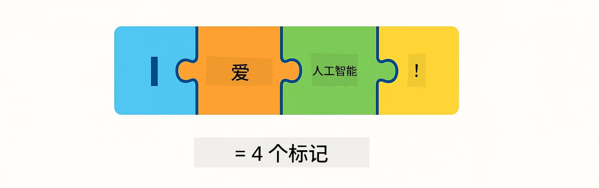
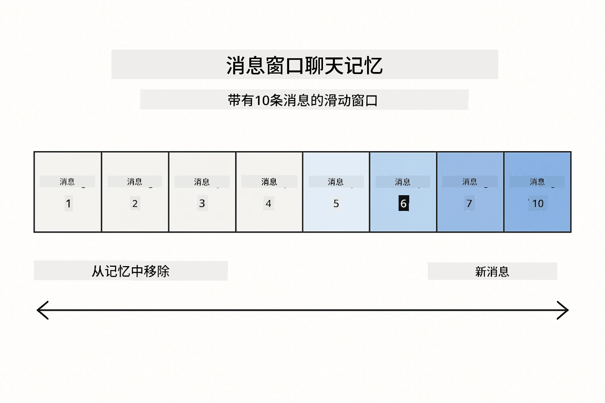
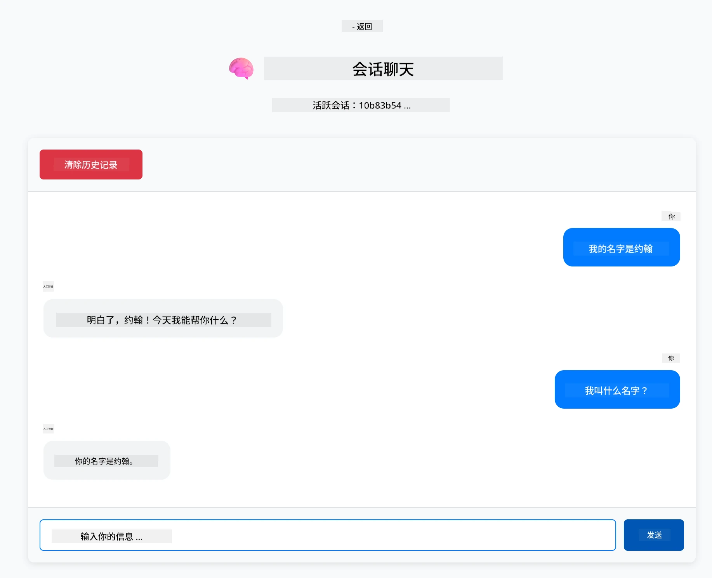

<!--
CO_OP_TRANSLATOR_METADATA:
{
  "original_hash": "c3e07ca58d0b8a3f47d3bf5728541e0a",
  "translation_date": "2025-12-13T13:10:36+00:00",
  "source_file": "01-introduction/README.md",
  "language_code": "zh"
}
-->
# 模块 01：LangChain4j 入门

## 目录

- [你将学到什么](../../../01-introduction)
- [先决条件](../../../01-introduction)
- [理解核心问题](../../../01-introduction)
- [理解令牌](../../../01-introduction)
- [内存如何工作](../../../01-introduction)
- [如何使用 LangChain4j](../../../01-introduction)
- [部署 Azure OpenAI 基础设施](../../../01-introduction)
- [本地运行应用程序](../../../01-introduction)
- [使用应用程序](../../../01-introduction)
  - [无状态聊天（左侧面板）](../../../01-introduction)
  - [有状态聊天（右侧面板）](../../../01-introduction)
- [下一步](../../../01-introduction)

## 你将学到什么

如果你完成了快速入门，你已经看到如何发送提示并获得响应。这是基础，但真正的应用需要更多。本模块将教你如何构建能够记住上下文并维护状态的对话式 AI——这就是一次性演示和生产级应用之间的区别。

本指南将全程使用 Azure OpenAI 的 GPT-5，因为其高级推理能力使不同模式的行为更为明显。当你添加内存时，你会清楚地看到差异。这使得理解每个组件为你的应用带来了什么变得更容易。

你将构建一个演示两种模式的应用：

**无状态聊天** - 每个请求都是独立的。模型不会记住之前的消息。这是你在快速入门中使用的模式。

**有状态对话** - 每个请求都包含对话历史。模型在多轮对话中维护上下文。这是生产应用所需的。

## 先决条件

- 拥有 Azure 订阅并具备 Azure OpenAI 访问权限
- Java 21，Maven 3.9+
- Azure CLI (https://learn.microsoft.com/en-us/cli/azure/install-azure-cli)
- Azure Developer CLI (azd) (https://learn.microsoft.com/en-us/azure/developer/azure-developer-cli/install-azd)

> **注意：** 提供的开发容器中预装了 Java、Maven、Azure CLI 和 Azure Developer CLI (azd)。

> **注意：** 本模块使用 Azure OpenAI 上的 GPT-5。部署通过 `azd up` 自动配置——请勿修改代码中的模型名称。

## 理解核心问题

语言模型是无状态的。每次 API 调用都是独立的。如果你发送“我叫 John”，然后问“我叫什么名字？”，模型根本不知道你刚刚介绍过自己。它把每个请求都当作你第一次对话。

这对于简单的问答还可以，但对真实应用毫无用处。客服机器人需要记住你告诉它的内容。个人助理需要上下文。任何多轮对话都需要内存。


*无状态（独立调用）与有状态（上下文感知）对话的区别*

## 理解令牌

在深入对话之前，理解令牌很重要——它是语言模型处理的基本文本单位：



*文本如何被拆分成令牌的示例——“I love AI!” 被拆成4个独立处理单元*

令牌是 AI 模型衡量和处理文本的方式。单词、标点甚至空格都可以是令牌。你的模型有一次能处理的令牌数量限制（GPT-5 为 400,000，最多 272,000 输入令牌和 128,000 输出令牌）。理解令牌有助于你管理对话长度和成本。

## 内存如何工作

聊天内存通过维护对话历史解决了无状态问题。在将请求发送给模型之前，框架会预先添加相关的先前消息。当你问“我叫什么名字？”时，系统实际上发送了整个对话历史，让模型看到你之前说过“我叫 John”。

LangChain4j 提供了自动处理此功能的内存实现。你可以选择保留多少条消息，框架会管理上下文窗口。



*MessageWindowChatMemory 维护最近消息的滑动窗口，自动丢弃旧消息*

## 如何使用 LangChain4j

本模块在快速入门基础上扩展，集成了 Spring Boot 并添加了对话内存。组件组合如下：

**依赖项** - 添加两个 LangChain4j 库：

```xml
<dependency>
    <groupId>dev.langchain4j</groupId>
    <artifactId>langchain4j</artifactId> <!-- Inherited from BOM in root pom.xml -->
</dependency>
<dependency>
    <groupId>dev.langchain4j</groupId>
    <artifactId>langchain4j-open-ai-official</artifactId> <!-- Inherited from BOM in root pom.xml -->
</dependency>
```

**聊天模型** - 将 Azure OpenAI 配置为 Spring Bean（[LangChainConfig.java](../../../01-introduction/src/main/java/com/example/langchain4j/config/LangChainConfig.java)）：

```java
@Bean
public OpenAiOfficialChatModel openAiOfficialChatModel() {
    return OpenAiOfficialChatModel.builder()
            .baseUrl(azureEndpoint)
            .apiKey(azureApiKey)
            .modelName(deploymentName)
            .timeout(Duration.ofMinutes(5))
            .maxRetries(3)
            .build();
}
```

构建器从 `azd up` 设置的环境变量读取凭据。将 `baseUrl` 设置为你的 Azure 端点，使 OpenAI 客户端能与 Azure OpenAI 配合使用。

**对话内存** - 使用 MessageWindowChatMemory 跟踪聊天历史（[ConversationService.java](../../../01-introduction/src/main/java/com/example/langchain4j/service/ConversationService.java)）：

```java
ChatMemory memory = MessageWindowChatMemory.withMaxMessages(10);

memory.add(UserMessage.from("My name is John"));
memory.add(AiMessage.from("Nice to meet you, John!"));

memory.add(UserMessage.from("What's my name?"));
AiMessage aiMessage = chatModel.chat(memory.messages()).aiMessage();
memory.add(aiMessage);
```

使用 `withMaxMessages(10)` 创建内存，保留最近 10 条消息。通过类型包装器添加用户和 AI 消息：`UserMessage.from(text)` 和 `AiMessage.from(text)`。用 `memory.messages()` 获取历史并发送给模型。服务为每个对话 ID 存储独立内存实例，支持多用户同时聊天。

> **🤖 试试 [GitHub Copilot](https://github.com/features/copilot) 聊天：** 打开 [`ConversationService.java`](../../../01-introduction/src/main/java/com/example/langchain4j/service/ConversationService.java)，问：
> - “当窗口满了时，MessageWindowChatMemory 如何决定丢弃哪些消息？”
> - “我能否用数据库实现自定义内存存储，而不是内存中存储？”
> - “如何添加摘要功能来压缩旧的对话历史？”

无状态聊天端点完全跳过内存——就像快速入门一样，直接调用 `chatModel.chat(prompt)`。有状态端点则将消息添加到内存，检索历史，并将上下文包含在每次请求中。模型配置相同，模式不同。

## 部署 Azure OpenAI 基础设施

**Bash:**
```bash
cd 01-introduction
azd up  # 选择订阅和位置（推荐 eastus2）
```

**PowerShell:**
```powershell
cd 01-introduction
azd up  # 选择订阅和位置（推荐 eastus2）
```

> **注意：** 如果遇到超时错误（`RequestConflict: Cannot modify resource ... provisioning state is not terminal`），只需再次运行 `azd up`。Azure 资源可能仍在后台部署，重试可在资源达到终态后完成部署。

此操作将：
1. 部署包含 GPT-5 和 text-embedding-3-small 模型的 Azure OpenAI 资源
2. 自动在项目根目录生成带凭据的 `.env` 文件
3. 设置所有必需的环境变量

**部署遇到问题？** 请参阅 [基础设施 README](infra/README.md) 获取详细故障排除，包括子域名冲突、手动 Azure 门户部署步骤和模型配置指导。

**验证部署是否成功：**

**Bash:**
```bash
cat ../.env  # 应显示 AZURE_OPENAI_ENDPOINT、API_KEY 等。
```

**PowerShell:**
```powershell
Get-Content ..\.env  # 应显示 AZURE_OPENAI_ENDPOINT、API_KEY 等。
```

> **注意：** `azd up` 命令会自动生成 `.env` 文件。如果需要后续更新，可以手动编辑 `.env` 文件，或通过运行以下命令重新生成：
>
> **Bash:**
> ```bash
> cd ..
> bash .azd-env.sh
> ```
>
> **PowerShell:**
> ```powershell
> cd ..
> .\.azd-env.ps1
> ```

## 本地运行应用程序

**验证部署：**

确保根目录存在包含 Azure 凭据的 `.env` 文件：

**Bash:**
```bash
cat ../.env  # 应显示 AZURE_OPENAI_ENDPOINT、API_KEY、DEPLOYMENT
```

**PowerShell:**
```powershell
Get-Content ..\.env  # 应显示 AZURE_OPENAI_ENDPOINT、API_KEY、DEPLOYMENT
```

**启动应用程序：**

**选项 1：使用 Spring Boot Dashboard（推荐 VS Code 用户）**

开发容器包含 Spring Boot Dashboard 扩展，提供管理所有 Spring Boot 应用的可视界面。你可以在 VS Code 左侧活动栏找到它（寻找 Spring Boot 图标）。

通过 Spring Boot Dashboard，你可以：
- 查看工作区内所有可用的 Spring Boot 应用
- 一键启动/停止应用
- 实时查看应用日志
- 监控应用状态

只需点击“introduction”旁的播放按钮启动本模块，或一次启动所有模块。


**选项 2：使用 shell 脚本**

启动所有 Web 应用（模块 01-04）：

**Bash:**
```bash
cd ..  # 从根目录
./start-all.sh
```

**PowerShell:**
```powershell
cd ..  # 从根目录
.\start-all.ps1
```

或仅启动本模块：

**Bash:**
```bash
cd 01-introduction
./start.sh
```

**PowerShell:**
```powershell
cd 01-introduction
.\start.ps1
```

两个脚本都会自动从根目录 `.env` 文件加载环境变量，并在 JAR 不存在时构建它们。

> **注意：** 如果你想先手动构建所有模块再启动：
>
> **Bash:**
> ```bash
> cd ..  # Go to root directory
> mvn clean package -DskipTests
> ```
>
> **PowerShell:**
> ```powershell
> cd ..  # Go to root directory
> mvn clean package -DskipTests
> ```

在浏览器中打开 http://localhost:8080 。

**停止应用：**

**Bash:**
```bash
./stop.sh  # 仅此模块
# 或
cd .. && ./stop-all.sh  # 所有模块
```

**PowerShell:**
```powershell
.\stop.ps1  # 仅此模块
# 或
cd ..; .\stop-all.ps1  # 所有模块
```

## 使用应用程序

该应用提供了一个网页界面，左右并排展示两种聊天实现。


*仪表盘显示简单聊天（无状态）和对话聊天（有状态）选项*

### 无状态聊天（左侧面板）

先试试这个。先问“我叫 John”，然后立即问“我叫什么名字？”模型不会记得，因为每条消息都是独立的。这演示了基础语言模型集成的核心问题——没有对话上下文。


*AI 不会记住你上一条消息中的名字*

### 有状态聊天（右侧面板）

现在在这里试同样的顺序。先问“我叫 John”，再问“我叫什么名字？”这次它记得了。区别在于 MessageWindowChatMemory——它维护对话历史，并将其包含在每次请求中。这就是生产级对话式 AI 的工作方式。



*AI 记得你之前对话中的名字*

两个面板都使用相同的 GPT-5 模型。唯一的区别是内存。这清楚地展示了内存为你的应用带来了什么，以及为什么它对真实用例至关重要。

## 下一步

**下一个模块：** [02-prompt-engineering - 使用 GPT-5 的提示工程](../02-prompt-engineering/README.md)

---

**导航：** [← 上一节：模块 00 - 快速入门](../00-quick-start/README.md) | [返回主页](../README.md) | [下一节：模块 02 - 提示工程 →](../02-prompt-engineering/README.md)

---

<!-- CO-OP TRANSLATOR DISCLAIMER START -->
**免责声明**：  
本文件由人工智能翻译服务[Co-op Translator](https://github.com/Azure/co-op-translator)翻译而成。虽然我们力求准确，但请注意自动翻译可能存在错误或不准确之处。原始文件的母语版本应被视为权威来源。对于重要信息，建议使用专业人工翻译。因使用本翻译而产生的任何误解或误释，我们概不负责。
<!-- CO-OP TRANSLATOR DISCLAIMER END -->