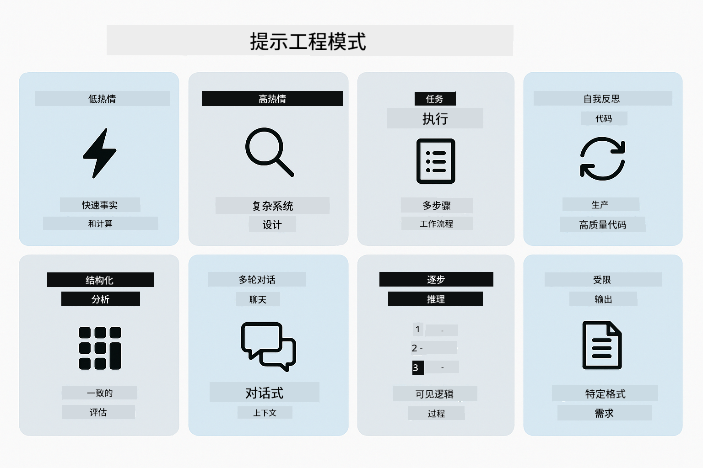
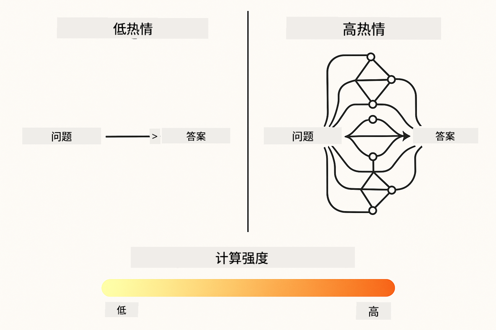
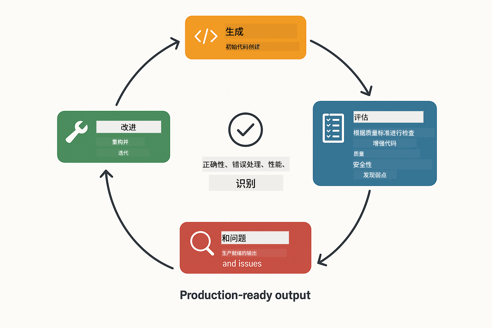
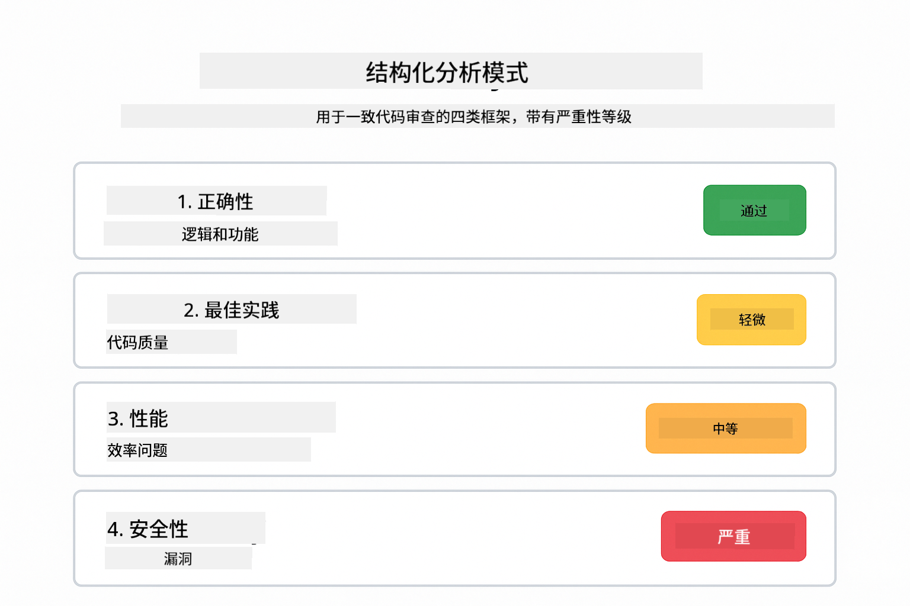
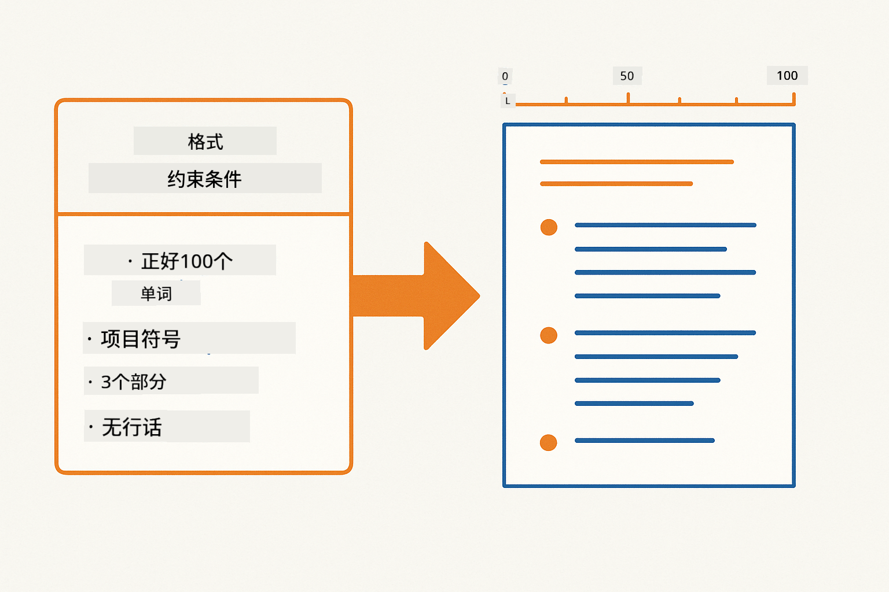
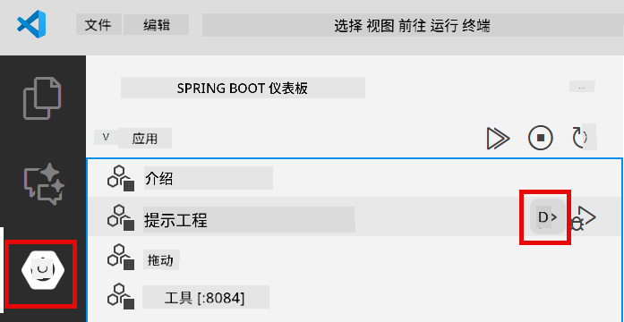
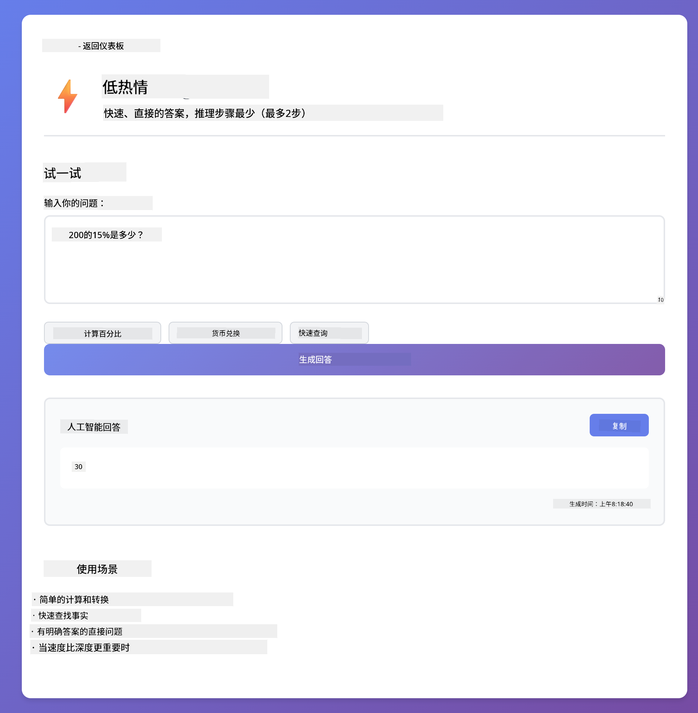
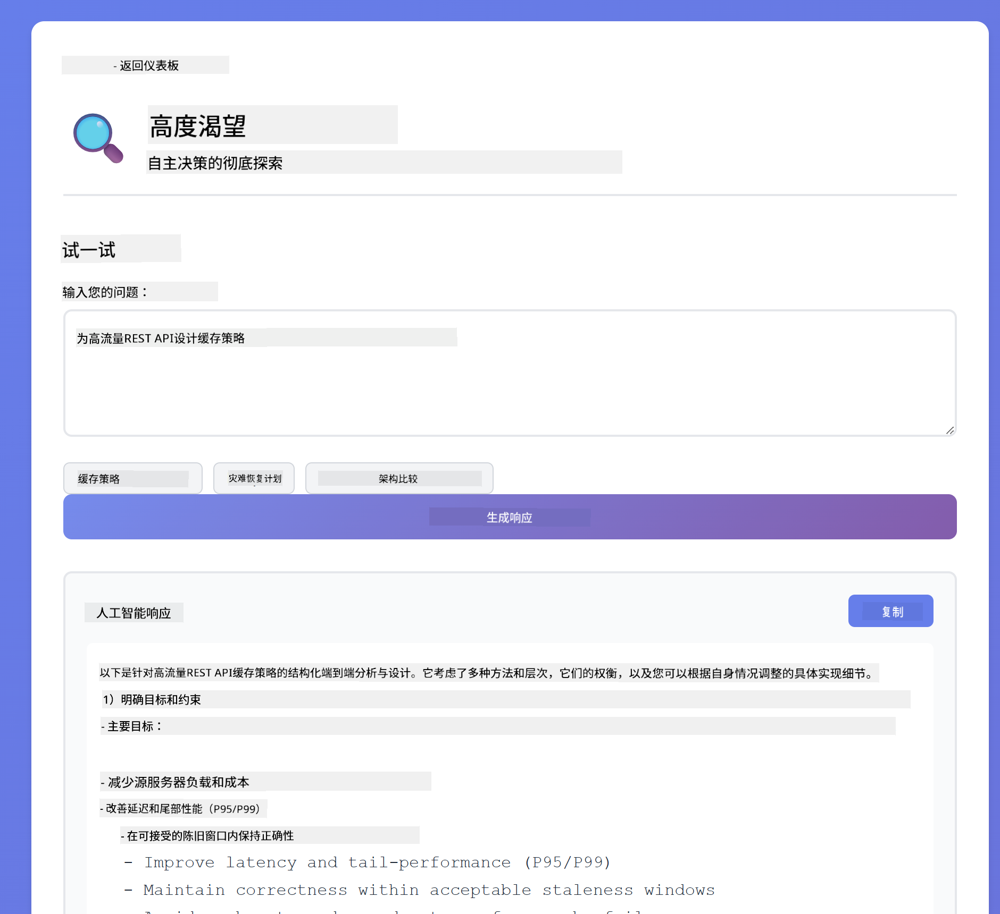
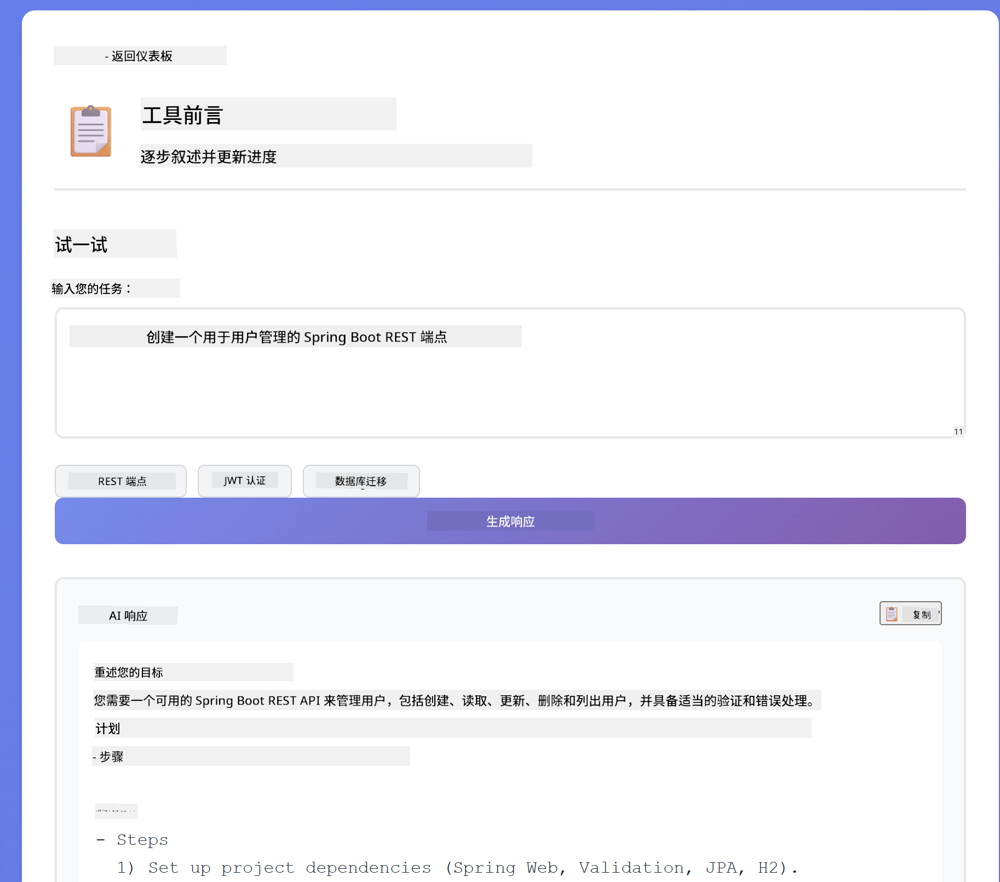
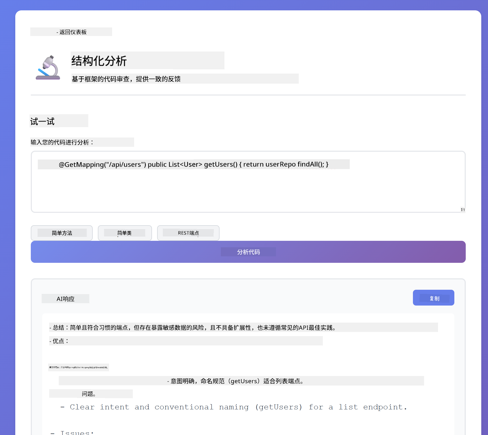

<!--
CO_OP_TRANSLATOR_METADATA:
{
  "original_hash": "8d787826cad7e92bf5cdbd116b1e6116",
  "translation_date": "2025-12-13T15:52:03+00:00",
  "source_file": "02-prompt-engineering/README.md",
  "language_code": "zh"
}
-->
# 模块 02：使用 GPT-5 的提示工程

## 目录

- [你将学到什么](../../../02-prompt-engineering)
- [先决条件](../../../02-prompt-engineering)
- [理解提示工程](../../../02-prompt-engineering)
- [如何使用 LangChain4j](../../../02-prompt-engineering)
- [核心模式](../../../02-prompt-engineering)
- [使用现有的 Azure 资源](../../../02-prompt-engineering)
- [应用截图](../../../02-prompt-engineering)
- [探索模式](../../../02-prompt-engineering)
  - [低积极性 vs 高积极性](../../../02-prompt-engineering)
  - [任务执行（工具前言）](../../../02-prompt-engineering)
  - [自我反思代码](../../../02-prompt-engineering)
  - [结构化分析](../../../02-prompt-engineering)
  - [多轮聊天](../../../02-prompt-engineering)
  - [逐步推理](../../../02-prompt-engineering)
  - [受限输出](../../../02-prompt-engineering)
- [你真正学到的是什么](../../../02-prompt-engineering)
- [下一步](../../../02-prompt-engineering)

## 你将学到什么

在前一个模块中，你了解了内存如何支持对话式 AI，并使用 GitHub 模型进行基本交互。现在我们将重点关注如何提问——即提示本身——使用 Azure OpenAI 的 GPT-5。你构造提示的方式会极大影响你获得的回答质量。

我们使用 GPT-5 是因为它引入了推理控制——你可以告诉模型在回答前需要思考多少。这使得不同的提示策略更加明显，帮助你理解何时使用哪种方法。相比 GitHub 模型，Azure 对 GPT-5 的速率限制更少，我们也能从中受益。

## 先决条件

- 完成模块 01（已部署 Azure OpenAI 资源）
- 根目录下有包含 Azure 凭据的 `.env` 文件（由模块 01 中的 `azd up` 创建）

> **注意：** 如果你还没有完成模块 01，请先按照那里的部署说明操作。

## 理解提示工程

提示工程是设计输入文本，使你始终获得所需结果的过程。它不仅仅是提问——而是构造请求，让模型准确理解你想要什么以及如何交付。

把它想象成给同事下指令。“修复 bug”太模糊了。“通过添加空指针检查修复 UserService.java 第 45 行的空指针异常”则很具体。语言模型也是如此——具体性和结构很重要。

## 如何使用 LangChain4j

本模块演示了使用之前模块相同的 LangChain4j 基础的高级提示模式，重点是提示结构和推理控制。


*LangChain4j 如何将你的提示连接到 Azure OpenAI GPT-5*

**依赖项** - 模块 02 使用 `pom.xml` 中定义的以下 langchain4j 依赖：
```xml
<dependency>
    <groupId>dev.langchain4j</groupId>
    <artifactId>langchain4j</artifactId> <!-- Inherited from BOM in root pom.xml -->
</dependency>
<dependency>
    <groupId>dev.langchain4j</groupId>
    <artifactId>langchain4j-open-ai-official</artifactId> <!-- Inherited from BOM in root pom.xml -->
</dependency>
```

**OpenAiOfficialChatModel 配置** - [LangChainConfig.java](../../../02-prompt-engineering/src/main/java/com/example/langchain4j/prompts/config/LangChainConfig.java)

聊天模型作为 Spring bean 手动配置，使用支持 Azure OpenAI 端点的 OpenAI 官方客户端。与模块 01 的关键区别在于我们如何构造发送给 `chatModel.chat()` 的提示，而不是模型本身的设置。

**系统和用户消息** - [Gpt5PromptService.java](../../../02-prompt-engineering/src/main/java/com/example/langchain4j/prompts/service/Gpt5PromptService.java)

LangChain4j 将消息类型分开以提高清晰度。`SystemMessage` 设置 AI 的行为和上下文（例如“你是代码审查员”），而 `UserMessage` 包含实际请求。这种分离让你能在不同用户查询间保持一致的 AI 行为。

```java
SystemMessage systemMsg = SystemMessage.from(
    "You are a helpful Java programming expert."
);

UserMessage userMsg = UserMessage.from(
    "Explain what a List is in Java"
);

String response = chatModel.chat(systemMsg, userMsg);
```


*SystemMessage 提供持久上下文，UserMessages 包含单独请求*

**多轮对话的 MessageWindowChatMemory** - 对于多轮对话模式，我们重用模块 01 中的 `MessageWindowChatMemory`。每个会话都有自己的内存实例，存储在 `Map<String, ChatMemory>` 中，允许多个并发对话而不混淆上下文。

**提示模板** - 这里的重点是提示工程，而非新的 LangChain4j API。每种模式（低积极性、高积极性、任务执行等）都使用相同的 `chatModel.chat(prompt)` 方法，但提示字符串结构经过精心设计。XML 标签、指令和格式都是提示文本的一部分，而非 LangChain4j 功能。

**推理控制** - GPT-5 的推理力度通过提示指令控制，如“最多 2 步推理”或“彻底探索”。这些是提示工程技术，不是 LangChain4j 配置。库只是将你的提示传递给模型。

关键点：LangChain4j 提供基础设施（通过 [LangChainConfig.java](../../../02-prompt-engineering/src/main/java/com/example/langchain4j/prompts/config/LangChainConfig.java) 连接模型，内存和消息处理通过 [Gpt5PromptService.java](../../../02-prompt-engineering/src/main/java/com/example/langchain4j/prompts/service/Gpt5PromptService.java)），而本模块教你如何在该基础设施内构建有效提示。

## 核心模式

不是所有问题都需要相同的方法。有些问题需要快速回答，有些需要深入思考。有些需要可见推理，有些只要结果。本模块涵盖八种提示模式——每种针对不同场景优化。你将尝试所有模式，学习何时使用哪种方法最合适。



*八种提示工程模式及其使用场景概览*



*低积极性（快速、直接）与高积极性（彻底、探索性）推理方法对比*

**低积极性（快速且聚焦）** - 适用于你想要快速、直接答案的简单问题。模型进行最少推理——最多 2 步。用于计算、查询或直接问题。

```java
String prompt = """
    <reasoning_effort>low</reasoning_effort>
    <instruction>maximum 2 reasoning steps</instruction>
    
    What is 15% of 200?
    """;

String response = chatModel.chat(prompt);
```

> 💡 **用 GitHub Copilot 探索：** 打开 [`Gpt5PromptService.java`](../../../02-prompt-engineering/src/main/java/com/example/langchain4j/prompts/service/Gpt5PromptService.java)，尝试问：
> - “低积极性和高积极性提示模式有什么区别？”
> - “提示中的 XML 标签如何帮助构造 AI 的回答？”
> - “什么时候该用自我反思模式，什么时候用直接指令？”

**高积极性（深入且彻底）** - 适用于你想要全面分析的复杂问题。模型会彻底探索并展示详细推理。用于系统设计、架构决策或复杂研究。

```java
String prompt = """
    <reasoning_effort>high</reasoning_effort>
    <instruction>explore thoroughly, show detailed reasoning</instruction>
    
    Design a caching strategy for a high-traffic REST API.
    """;

String response = chatModel.chat(prompt);
```

**任务执行（逐步进展）** - 适用于多步骤工作流。模型先给出计划，边执行边叙述每步，最后总结。用于迁移、实现或任何多步骤流程。

```java
String prompt = """
    <task>Create a REST endpoint for user registration</task>
    <preamble>Provide an upfront plan</preamble>
    <narration>Narrate each step as you work</narration>
    <summary>Summarize what was accomplished</summary>
    """;

String response = chatModel.chat(prompt);
```

链式思维提示明确要求模型展示推理过程，提高复杂任务的准确性。逐步拆解帮助人类和 AI 理解逻辑。

> **🤖 用 [GitHub Copilot](https://github.com/features/copilot) 聊天试试：** 询问此模式：
> - “如何调整任务执行模式以支持长时间运行操作？”
> - “生产应用中结构化工具前言的最佳实践是什么？”
> - “如何在 UI 中捕获并显示中间进度更新？”


*计划 → 执行 → 总结的多步骤任务工作流*

**自我反思代码** - 用于生成生产级代码。模型生成代码，依据质量标准检查并迭代改进。适合构建新功能或服务。

```java
String prompt = """
    <task>Create an email validation service</task>
    <quality_criteria>
    - Correct logic and error handling
    - Best practices (clean code, proper naming)
    - Performance optimization
    - Security considerations
    </quality_criteria>
    <instruction>Generate code, evaluate against criteria, improve iteratively</instruction>
    """;

String response = chatModel.chat(prompt);
```



*迭代改进循环——生成、评估、识别问题、改进、重复*

**结构化分析** - 用于一致性评估。模型使用固定框架（正确性、实践、性能、安全）审查代码。适合代码审查或质量评估。

```java
String prompt = """
    <code>
    public List getUsers() {
        return database.query("SELECT * FROM users");
    }
    </code>
    
    <framework>
    Evaluate using these categories:
    1. Correctness - Logic and functionality
    2. Best Practices - Code quality
    3. Performance - Efficiency concerns
    4. Security - Vulnerabilities
    </framework>
    """;

String response = chatModel.chat(prompt);
```

> **🤖 用 [GitHub Copilot](https://github.com/features/copilot) 聊天试试：** 询问结构化分析：
> - “如何为不同类型的代码审查定制分析框架？”
> - “以编程方式解析和处理结构化输出的最佳方法是什么？”
> - “如何确保不同审查会话中严重级别的一致性？”



*四类框架实现一致代码审查及严重级别*

**多轮聊天** - 适用于需要上下文的对话。模型记住之前消息并基于此构建。用于交互式帮助或复杂问答。

```java
ChatMemory memory = MessageWindowChatMemory.withMaxMessages(10);

memory.add(UserMessage.from("What is Spring Boot?"));
AiMessage aiMessage1 = chatModel.chat(memory.messages()).aiMessage();
memory.add(aiMessage1);

memory.add(UserMessage.from("Show me an example"));
AiMessage aiMessage2 = chatModel.chat(memory.messages()).aiMessage();
memory.add(aiMessage2);
```


*对话上下文如何在多轮中累积，直到达到令牌限制*

**逐步推理** - 适用于需要可见逻辑的问题。模型展示每步的明确推理。用于数学题、逻辑谜题或需要理解思考过程的场景。

```java
String prompt = """
    <instruction>Show your reasoning step-by-step</instruction>
    
    If a train travels 120 km in 2 hours, then stops for 30 minutes,
    then travels another 90 km in 1.5 hours, what is the average speed
    for the entire journey including the stop?
    """;

String response = chatModel.chat(prompt);
```


*将问题拆解为明确的逻辑步骤*

**受限输出** - 适用于有特定格式要求的回答。模型严格遵守格式和长度规则。用于摘要或需要精确输出结构的场景。

```java
String prompt = """
    <constraints>
    - Exactly 100 words
    - Bullet point format
    - Technical terms only
    </constraints>
    
    Summarize the key concepts of machine learning.
    """;

String response = chatModel.chat(prompt);
```



*强制执行特定格式、长度和结构要求*

## 使用现有的 Azure 资源

**验证部署：**

确保根目录下存在包含 Azure 凭据的 `.env` 文件（模块 01 部署时创建）：
```bash
cat ../.env  # 应显示 AZURE_OPENAI_ENDPOINT、API_KEY、DEPLOYMENT
```

**启动应用：**

> **注意：** 如果你已经使用模块 01 中的 `./start-all.sh` 启动了所有应用，本模块已在端口 8083 运行。你可以跳过下面的启动命令，直接访问 http://localhost:8083。

**选项 1：使用 Spring Boot Dashboard（推荐 VS Code 用户）**

开发容器包含 Spring Boot Dashboard 扩展，提供可视化界面管理所有 Spring Boot 应用。你可以在 VS Code 左侧活动栏找到它（寻找 Spring Boot 图标）。

通过 Spring Boot Dashboard，你可以：
- 查看工作区内所有可用的 Spring Boot 应用
- 一键启动/停止应用
- 实时查看应用日志
- 监控应用状态

只需点击“prompt-engineering”旁的播放按钮启动本模块，或一次启动所有模块。



**选项 2：使用 shell 脚本**

启动所有 Web 应用（模块 01-04）：

**Bash:**
```bash
cd ..  # 从根目录
./start-all.sh
```

**PowerShell:**
```powershell
cd ..  # 从根目录
.\start-all.ps1
```

或者只启动本模块：

**Bash:**
```bash
cd 02-prompt-engineering
./start.sh
```

**PowerShell:**
```powershell
cd 02-prompt-engineering
.\start.ps1
```

两个脚本都会自动从根目录 `.env` 文件加载环境变量，如果 JAR 文件不存在会自动构建。

> **注意：** 如果你想先手动构建所有模块再启动：
>
> **Bash:**
> ```bash
> cd ..  # Go to root directory
> mvn clean package -DskipTests
> ```
>
> **PowerShell:**
> ```powershell
> cd ..  # Go to root directory
> mvn clean package -DskipTests
> ```

在浏览器中打开 http://localhost:8083。

**停止应用：**

**Bash:**
```bash
./stop.sh  # 仅此模块
# 或
cd .. && ./stop-all.sh  # 所有模块
```

**PowerShell:**
```powershell
.\stop.ps1  # 仅此模块
# 或
cd ..; .\stop-all.ps1  # 所有模块
```

## 应用截图


*主仪表盘显示所有 8 种提示工程模式及其特点和使用场景*

## 探索模式

网页界面让你尝试不同的提示策略。每种模式解决不同问题——试试它们，看看哪种方法最适合。

### 低积极性 vs 高积极性

用低积极性问一个简单问题，比如“200 的 15% 是多少？”，你会得到即时、直接的答案。现在用高积极性问一个复杂问题，比如“为高流量 API 设计缓存策略”。观察模型如何放慢速度，提供详细推理。同一个模型，同样的问题结构——但提示告诉它思考多少。


*快速计算，推理最少*



*全面缓存策略（2.8MB）*

### 任务执行（工具前言）

多步骤工作流受益于事先规划和过程叙述。模型会概述它将做什么，叙述每一步，然后总结结果。



*带有逐步叙述的 REST 端点创建（3.9MB）*

### 自我反思代码

尝试“创建一个电子邮件验证服务”。模型不仅生成代码然后停止，而是生成后根据质量标准进行评估，识别弱点并改进。你会看到它反复迭代，直到代码达到生产标准。


*完整的电子邮件验证服务（5.2MB）*

### 结构化分析

代码审查需要一致的评估框架。模型使用固定类别（正确性、实践、性能、安全）及严重性等级来分析代码。



*基于框架的代码审查*

### 多轮对话

问“什么是 Spring Boot？”，然后紧接着问“给我一个示例”。模型记住你的第一个问题，并专门给你一个 Spring Boot 示例。没有记忆，第二个问题会太模糊。


*跨问题的上下文保持*

### 逐步推理

选择一个数学问题，分别用逐步推理和低热情尝试。低热情只给你答案——快速但不透明。逐步推理展示每个计算和决策。


*带有明确步骤的数学问题*

### 受限输出

当你需要特定格式或字数时，这种模式强制严格遵守。试着生成一个恰好100字的项目符号格式摘要。


*带格式控制的机器学习摘要*

## 你真正学到的是什么

**推理努力改变一切**

GPT-5 让你通过提示控制计算努力。低努力意味着快速响应，探索最少。高努力意味着模型花时间深入思考。你正在学习根据任务复杂度匹配努力——不要在简单问题上浪费时间，也不要在复杂决策上匆忙。

**结构引导行为**

注意提示中的 XML 标签？它们不是装饰。模型比自由文本更可靠地遵循结构化指令。当你需要多步骤流程或复杂逻辑时，结构帮助模型跟踪当前位置和下一步。


*结构良好的提示解剖，带有清晰部分和 XML 风格组织*

**通过自我评估保证质量**

自我反思模式通过明确质量标准起作用。你不是希望模型“做对”，而是告诉它“对”意味着什么：正确逻辑、错误处理、性能、安全。模型随后可以评估自身输出并改进。这让代码生成从彩票变成了过程。

**上下文是有限的**

多轮对话通过每次请求包含消息历史实现。但有上限——每个模型都有最大令牌数。随着对话增长，你需要策略保持相关上下文而不超限。本模块展示记忆如何工作；后续你将学会何时总结、何时遗忘、何时检索。

## 下一步

**下一模块：** [03-rag - RAG（检索增强生成）](../03-rag/README.md)

---

**导航：** [← 上一：模块 01 - 介绍](../01-introduction/README.md) | [返回主页](../README.md) | [下一：模块 03 - RAG →](../03-rag/README.md)

---

<!-- CO-OP TRANSLATOR DISCLAIMER START -->
**免责声明**：  
本文件由人工智能翻译服务 [Co-op Translator](https://github.com/Azure/co-op-translator) 翻译而成。虽然我们力求准确，但请注意自动翻译可能存在错误或不准确之处。原始文件的母语版本应被视为权威来源。对于重要信息，建议使用专业人工翻译。我们不对因使用本翻译而产生的任何误解或误释承担责任。
<!-- CO-OP TRANSLATOR DISCLAIMER END -->