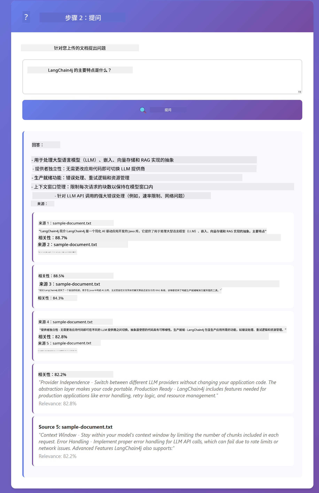

<!--
CO_OP_TRANSLATOR_METADATA:
{
  "original_hash": "f538a51cfd13147d40d84e936a0f485c",
  "translation_date": "2025-12-13T16:49:11+00:00",
  "source_file": "03-rag/README.md",
  "language_code": "zh"
}
-->
# 模块 03：RAG（检索增强生成）

## 目录

- [你将学到什么](../../../03-rag)
- [先决条件](../../../03-rag)
- [理解 RAG](../../../03-rag)
- [工作原理](../../../03-rag)
  - [文档处理](../../../03-rag)
  - [创建嵌入](../../../03-rag)
  - [语义搜索](../../../03-rag)
  - [答案生成](../../../03-rag)
- [运行应用程序](../../../03-rag)
- [使用应用程序](../../../03-rag)
  - [上传文档](../../../03-rag)
  - [提问](../../../03-rag)
  - [检查来源引用](../../../03-rag)
  - [尝试不同问题](../../../03-rag)
- [关键概念](../../../03-rag)
  - [分块策略](../../../03-rag)
  - [相似度分数](../../../03-rag)
  - [内存存储](../../../03-rag)
  - [上下文窗口管理](../../../03-rag)
- [RAG 何时重要](../../../03-rag)
- [下一步](../../../03-rag)

## 你将学到什么

在之前的模块中，你学习了如何与 AI 进行对话以及如何有效构建提示。但有一个根本限制：语言模型只知道它们在训练期间学到的内容。它们无法回答关于你公司政策、项目文档或任何未经过训练的信息的问题。

RAG（检索增强生成）解决了这个问题。它不是试图教模型你的信息（这既昂贵又不切实际），而是赋予它搜索你文档的能力。当有人提问时，系统会找到相关信息并将其包含在提示中。模型随后基于检索到的上下文进行回答。

可以把 RAG 想象成给模型提供了一个参考图书馆。当你提问时，系统：

1. **用户查询** - 你提出问题
2. **嵌入** - 将你的问题转换为向量
3. **向量搜索** - 找到相似的文档块
4. **上下文组装** - 将相关块添加到提示中
5. **响应** - 大型语言模型基于上下文生成答案

这使模型的回答基于你的实际数据，而不是依赖其训练知识或编造答案。


*RAG 工作流程 - 从用户查询到语义搜索再到上下文答案生成*

## 先决条件

- 完成模块 01（已部署 Azure OpenAI 资源）
- 根目录下有包含 Azure 凭据的 `.env` 文件（由模块 01 中的 `azd up` 创建）

> **注意：** 如果你还没有完成模块 01，请先按照那里的部署说明操作。

## 工作原理

**文档处理** - [DocumentService.java](../../../03-rag/src/main/java/com/example/langchain4j/rag/service/DocumentService.java)

当你上传文档时，系统会将其拆分成块——较小的片段，适合模型的上下文窗口。这些块之间有轻微重叠，以免在边界处丢失上下文。

```java
Document document = FileSystemDocumentLoader.loadDocument("sample-document.txt");

DocumentSplitter splitter = DocumentSplitters
    .recursive(300, 30, new OpenAiTokenizer());

List<TextSegment> segments = splitter.split(document);
```

> **🤖 试试用 [GitHub Copilot](https://github.com/features/copilot) 聊天：** 打开 [`DocumentService.java`](../../../03-rag/src/main/java/com/example/langchain4j/rag/service/DocumentService.java) 并提问：
> - “LangChain4j 如何将文档拆分成块，为什么重叠很重要？”
> - “不同文档类型的最佳块大小是多少，为什么？”
> - “如何处理多语言或带有特殊格式的文档？”

**创建嵌入** - [LangChainRagConfig.java](../../../03-rag/src/main/java/com/example/langchain4j/rag/config/LangChainRagConfig.java)

每个块被转换成一种称为嵌入的数值表示——本质上是捕捉文本含义的数学指纹。相似的文本会产生相似的嵌入。

```java
@Bean
public EmbeddingModel embeddingModel() {
    return OpenAiOfficialEmbeddingModel.builder()
        .baseUrl(azureOpenAiEndpoint)
        .apiKey(azureOpenAiKey)
        .modelName(azureEmbeddingDeploymentName)
        .build();
}

EmbeddingStore<TextSegment> embeddingStore = 
    new InMemoryEmbeddingStore<>();
```


*文档在嵌入空间中表示为向量——相似内容聚集在一起*

**语义搜索** - [RagService.java](../../../03-rag/src/main/java/com/example/langchain4j/rag/service/RagService.java)

当你提问时，你的问题也会被转换成嵌入。系统将你的问题嵌入与所有文档块的嵌入进行比较。它找到语义最相似的块——不仅仅是关键词匹配，而是真正的语义相似度。

```java
Embedding queryEmbedding = embeddingModel.embed(question).content();

List<EmbeddingMatch<TextSegment>> matches = 
    embeddingStore.findRelevant(queryEmbedding, 5, 0.7);

for (EmbeddingMatch<TextSegment> match : matches) {
    String relevantText = match.embedded().text();
    double score = match.score();
}
```

> **🤖 试试用 [GitHub Copilot](https://github.com/features/copilot) 聊天：** 打开 [`RagService.java`](../../../03-rag/src/main/java/com/example/langchain4j/rag/service/RagService.java) 并提问：
> - “嵌入的相似度搜索是如何工作的，分数由什么决定？”
> - “我应该使用什么相似度阈值，它如何影响结果？”
> - “如果找不到相关文档，我该怎么办？”

**答案生成** - [RagService.java](../../../03-rag/src/main/java/com/example/langchain4j/rag/service/RagService.java)

最相关的块会被包含在模型的提示中。模型阅读这些特定块，并基于这些信息回答你的问题。这防止了幻觉——模型只能基于眼前的信息回答。

## 运行应用程序

**验证部署：**

确保根目录下存在包含 Azure 凭据的 `.env` 文件（在模块 01 中创建）：
```bash
cat ../.env  # 应显示 AZURE_OPENAI_ENDPOINT、API_KEY、DEPLOYMENT
```

**启动应用程序：**

> **注意：** 如果你已经使用模块 01 中的 `./start-all.sh` 启动了所有应用程序，本模块已在端口 8081 上运行。你可以跳过下面的启动命令，直接访问 http://localhost:8081。

**选项 1：使用 Spring Boot Dashboard（推荐 VS Code 用户）**

开发容器包含 Spring Boot Dashboard 扩展，提供管理所有 Spring Boot 应用的可视界面。你可以在 VS Code 左侧活动栏找到它（寻找 Spring Boot 图标）。

通过 Spring Boot Dashboard，你可以：
- 查看工作区中所有可用的 Spring Boot 应用
- 一键启动/停止应用
- 实时查看应用日志
- 监控应用状态

只需点击 “rag” 旁的播放按钮启动此模块，或一次启动所有模块。


**选项 2：使用 shell 脚本**

启动所有 Web 应用（模块 01-04）：

**Bash:**
```bash
cd ..  # 从根目录
./start-all.sh
```

**PowerShell:**
```powershell
cd ..  # 从根目录
.\start-all.ps1
```

或者只启动本模块：

**Bash:**
```bash
cd 03-rag
./start.sh
```

**PowerShell:**
```powershell
cd 03-rag
.\start.ps1
```

两个脚本都会自动从根目录 `.env` 文件加载环境变量，并在 JAR 文件不存在时构建它们。

> **注意：** 如果你想在启动前手动构建所有模块：
>
> **Bash:**
> ```bash
> cd ..  # Go to root directory
> mvn clean package -DskipTests
> ```
>
> **PowerShell:**
> ```powershell
> cd ..  # Go to root directory
> mvn clean package -DskipTests
> ```

在浏览器中打开 http://localhost:8081。

**停止应用：**

**Bash:**
```bash
./stop.sh  # 仅此模块
# 或
cd .. && ./stop-all.sh  # 所有模块
```

**PowerShell:**
```powershell
.\stop.ps1  # 仅此模块
# 或
cd ..; .\stop-all.ps1  # 所有模块
```

## 使用应用程序

该应用提供了文档上传和提问的网页界面。

<a href="images/rag-homepage.png"></a>

*RAG 应用界面 - 上传文档并提问*

**上传文档**

首先上传文档——TXT 文件最适合测试。此目录下提供了一个 `sample-document.txt`，包含有关 LangChain4j 功能、RAG 实现和最佳实践的信息——非常适合测试系统。

系统会处理你的文档，将其拆分成块，并为每个块创建嵌入。这些操作在上传时自动完成。

**提问**

现在针对文档内容提出具体问题。尝试一些文档中明确陈述的事实性问题。系统会搜索相关块，将它们包含在提示中，并生成答案。

**检查来源引用**

注意每个答案都包含带有相似度分数的来源引用。这些分数（0 到 1）显示每个块与你问题的相关程度。分数越高，匹配越好。这样你可以根据源材料验证答案。

<a href="images/rag-query-results.png"></a>

*查询结果显示答案及来源引用和相关度分数*

**尝试不同问题**

尝试不同类型的问题：
- 具体事实：“主要话题是什么？”
- 比较：“X 和 Y 有什么区别？”
- 总结：“总结关于 Z 的关键点”

观察相关度分数如何根据你的问题与文档内容的匹配程度变化。

## 关键概念

**分块策略**

文档被拆分成 300 令牌的块，重叠 30 令牌。这个平衡确保每个块有足够的上下文且足够小，可以在提示中包含多个块。

**相似度分数**

分数范围为 0 到 1：
- 0.7-1.0：高度相关，完全匹配
- 0.5-0.7：相关，有良好上下文
- 低于 0.5：被过滤，差异太大

系统只检索高于最低阈值的块以保证质量。

**内存存储**

本模块使用内存存储以简化操作。重启应用时，上传的文档会丢失。生产系统使用持久化向量数据库，如 Qdrant 或 Azure AI Search。

**上下文窗口管理**

每个模型有最大上下文窗口。你不能包含大型文档的所有块。系统检索最相关的前 N 个块（默认 5 个），以保持在限制内，同时提供足够上下文以获得准确答案。

## RAG 何时重要

**使用 RAG 的场景：**
- 回答专有文档相关问题
- 信息频繁变化（政策、价格、规格）
- 需要准确的来源归属
- 内容太大，无法放入单个提示
- 需要可验证、基于事实的回答

**不适用 RAG 的场景：**
- 问题需要模型已有的一般知识
- 需要实时数据（RAG 基于上传文档）
- 内容足够小，可以直接包含在提示中

## 下一步

**下一个模块：** [04-tools - 使用工具的 AI 代理](../04-tools/README.md)

---

**导航：** [← 上一节：模块 02 - 提示工程](../02-prompt-engineering/README.md) | [返回主页](../README.md) | [下一节：模块 04 - 工具 →](../04-tools/README.md)

---

<!-- CO-OP TRANSLATOR DISCLAIMER START -->
**免责声明**：  
本文件由人工智能翻译服务 [Co-op Translator](https://github.com/Azure/co-op-translator) 翻译而成。虽然我们力求准确，但请注意，自动翻译可能包含错误或不准确之处。原始文件的母语版本应被视为权威来源。对于重要信息，建议使用专业人工翻译。因使用本翻译而产生的任何误解或误释，我们概不负责。
<!-- CO-OP TRANSLATOR DISCLAIMER END -->