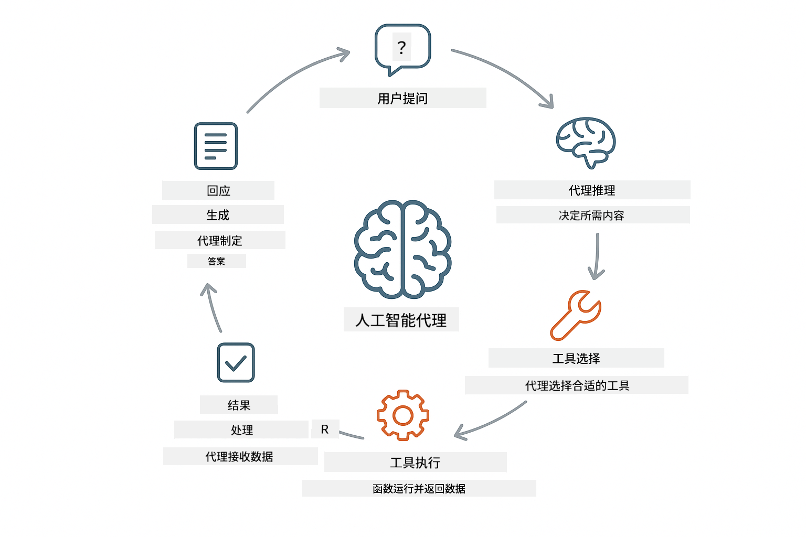
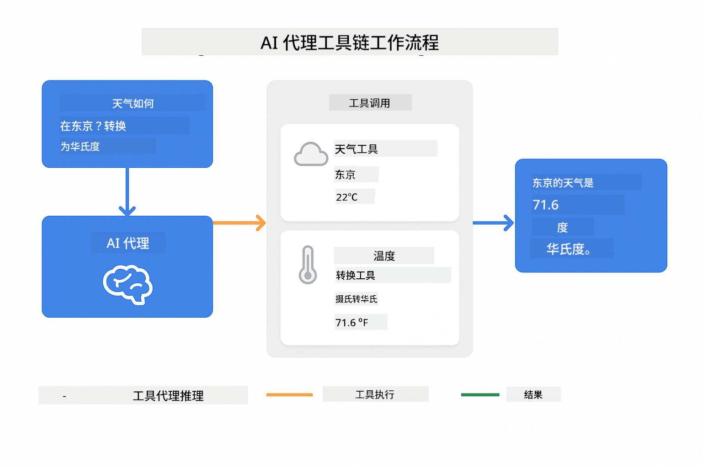
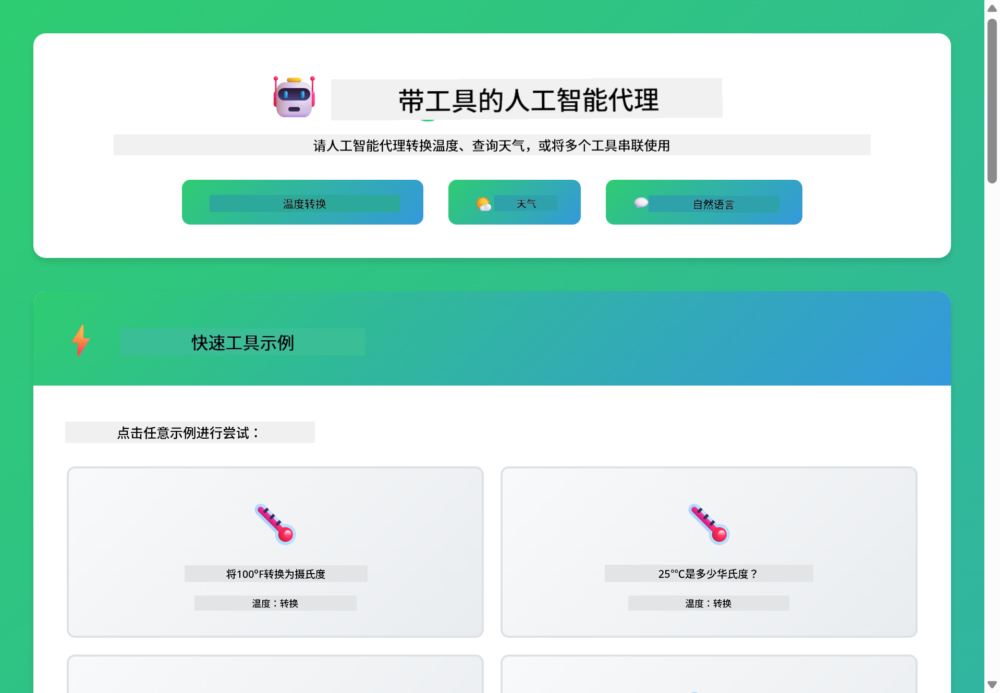
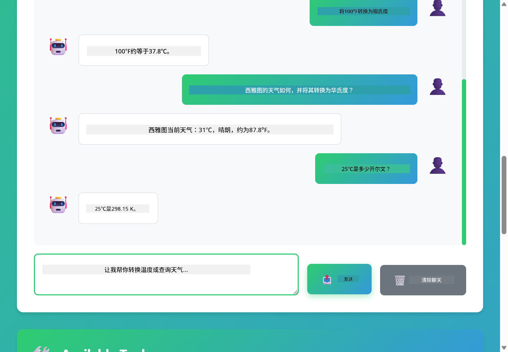

<!--
CO_OP_TRANSLATOR_METADATA:
{
  "original_hash": "13ec450c12cdd1a863baa2b778f27cd7",
  "translation_date": "2025-12-30T21:05:40+00:00",
  "source_file": "04-tools/README.md",
  "language_code": "zh"
}
-->
# Module 04: AI Agents with Tools

## Table of Contents

- [你将学到什么](../../../04-tools)
- [先决条件](../../../04-tools)
- [理解具有工具的 AI 代理](../../../04-tools)
- [工具调用的工作原理](../../../04-tools)
  - [工具定义](../../../04-tools)
  - [决策制定](../../../04-tools)
  - [执行](../../../04-tools)
  - [响应生成](../../../04-tools)
- [工具链](../../../04-tools)
- [运行应用程序](../../../04-tools)
- [使用应用程序](../../../04-tools)
  - [尝试简单的工具使用](../../../04-tools)
  - [测试工具链](../../../04-tools)
  - [查看对话流程](../../../04-tools)
  - [观察推理过程](../../../04-tools)
  - [尝试不同的请求](../../../04-tools)
- [关键概念](../../../04-tools)
  - [ReAct 模式（推理与行动）](../../../04-tools)
  - [工具描述很重要](../../../04-tools)
  - [会话管理](../../../04-tools)
  - [错误处理](../../../04-tools)
- [可用工具](../../../04-tools)
- [何时使用基于工具的代理](../../../04-tools)
- [下一步](../../../04-tools)

## What You'll Learn

到目前为止，你已经学会了如何与 AI 对话、如何有效构建提示词以及如何将响应与文档内容结合起来。但仍然存在一个根本限制：语言模型只能生成文本。它们无法查看天气、执行计算、查询数据库或与外部系统交互。

工具改变了这一点。通过为模型提供它可以调用的函数，你将其从文本生成器转变为可以采取行动的代理。模型决定何时需要工具、使用哪个工具以及传递哪些参数。你的代码执行该函数并返回结果。模型将该结果纳入其响应中。

## Prerequisites

- 完成 Module 01（已部署 Azure OpenAI 资源）
- 根目录下有 `.env` 文件，包含 Azure 凭据（由 Module 01 中的 `azd up` 创建）

> **注意：** 如果你还没有完成 Module 01，请先按照那里的部署说明操作。

## Understanding AI Agents with Tools

> **📝 注意：** 本模块中使用的“代理”一词指的是增强了工具调用能力的 AI 助手。这不同于我们将在 [Module 05: MCP](../05-mcp/README.md) 中讨论的 **Agentic AI** 模式（具有规划、记忆和多步推理的自治代理）。

具有工具的 AI 代理遵循一种推理与行动模式（ReAct）：

1. 用户提出问题
2. 代理推理它需要了解什么
3. 代理决定是否需要工具来回答
4. 如果需要，代理以正确的参数调用相应工具
5. 工具执行并返回数据
6. 代理将结果纳入并提供最终答案



*ReAct 模式——AI 代理如何在推理与行动之间交替以解决问题*

这是自动发生的。你定义工具及其描述。模型负责何时以及如何使用它们的决策。

## How Tool Calling Works

**Tool Definitions** - [WeatherTool.java](../../../04-tools/src/main/java/com/example/langchain4j/agents/tools/WeatherTool.java) | [TemperatureTool.java](../../../04-tools/src/main/java/com/example/langchain4j/agents/tools/TemperatureTool.java)

你定义带有清晰描述和参数规范的函数。模型在其系统提示中看到这些描述并理解每个工具的功能。

```java
@Component
public class WeatherTool {
    
    @Tool("Get the current weather for a location")
    public String getCurrentWeather(@P("Location name") String location) {
        // 您的天气查询逻辑
        return "Weather in " + location + ": 22°C, cloudy";
    }
}

@AiService
public interface Assistant {
    String chat(@MemoryId String sessionId, @UserMessage String message);
}

// Assistant 由 Spring Boot 自动装配：
// - ChatModel bean
// - 来自 @Component 类的所有 @Tool 方法
// - 用于会话管理的 ChatMemoryProvider
```

> **🤖 通过 [GitHub Copilot](https://github.com/features/copilot) 聊天尝试：** 打开 [`WeatherTool.java`](../../../04-tools/src/main/java/com/example/langchain4j/agents/tools/WeatherTool.java) 并询问：
> - “如何将真实的天气 API（例如 OpenWeatherMap）集成进来，而不是使用模拟数据？”
> - “什么样的工具描述能帮助 AI 正确使用它？”
> - “我如何在工具实现中处理 API 错误和速率限制？”

**决策制定**

当用户问“西雅图的天气如何？”时，模型会识别出它需要天气工具。它会生成一个带有 location 参数设置为 “Seattle” 的函数调用。

**执行** - [AgentService.java](../../../04-tools/src/main/java/com/example/langchain4j/agents/service/AgentService.java)

Spring Boot 会自动装配包含所有已注册工具的声明式 `@AiService` 接口，LangChain4j 会自动执行工具调用。

> **🤖 通过 [GitHub Copilot](https://github.com/features/copilot) 聊天尝试：** 打开 [`AgentService.java`](../../../04-tools/src/main/java/com/example/langchain4j/agents/service/AgentService.java) 并询问：
> - “ReAct 模式如何工作，为什么对 AI 代理有效？”
> - “代理如何决定使用哪个工具以及以什么顺序使用？”
> - “如果工具执行失败会发生什么——我应如何稳健地处理错误？”

**响应生成**

模型接收天气数据并将其格式化为对用户的自然语言响应。

### 为什么使用声明式 AI 服务？

本模块使用 LangChain4j 与 Spring Boot 的集成以及声明式 `@AiService` 接口：

- **Spring Boot 自动装配** - ChatModel 和工具会自动注入
- **@MemoryId 模式** - 自动的基于会话的内存管理
- **单实例** - 助手只创建一次并重复使用以提高性能
- **类型安全执行** - 直接调用 Java 方法并进行类型转换
- **多轮协调** - 自动处理工具链
- **零样板代码** - 不需要手动调用 AiServices.builder() 或维护内存 HashMap

替代方法（手动 `AiServices.builder()`）需要更多代码并且无法享受 Spring Boot 集成带来的好处。

## Tool Chaining

**工具链** - AI 可能会按顺序调用多个工具。问“西雅图的天气如何，我应该带伞吗？”并观察它如何将 `getCurrentWeather` 与关于雨具的推理链在一起。

<a href="images/tool-chaining.png"></a>

*顺序工具调用——一个工具的输出会被用于下一个决策*

**优雅的失败** - 请求不在模拟数据中的城市天气。工具会返回错误信息，AI 会解释它无法提供帮助。工具会安全失败。

这些发生在单次对话回合中。代理会自主协调多个工具调用。

## Run the Application

**验证部署：**

确保根目录有 `.env` 文件并包含 Azure 凭据（在 Module 01 中创建）：
```bash
cat ../.env  # 应该显示 AZURE_OPENAI_ENDPOINT、API_KEY、DEPLOYMENT
```

**启动应用程序：**

> **注意：** 如果你已经在 Module 01 中使用 `./start-all.sh` 启动了所有应用，本模块已经在端口 8084 上运行。你可以跳过下面的启动命令，直接访问 http://localhost:8084。

**选项 1：使用 Spring Boot Dashboard（推荐给 VS Code 用户）**

开发容器包含 Spring Boot Dashboard 扩展，它提供了一个可视化界面来管理所有 Spring Boot 应用。你可以在 VS Code 左侧的活动栏中找到它（查找 Spring Boot 图标）。

在 Spring Boot Dashboard 中，你可以：
- 查看工作区中所有可用的 Spring Boot 应用
- 单击即可启动/停止应用
- 实时查看应用日志
- 监控应用状态

只需单击 “tools” 旁边的播放按钮以启动此模块，或一次启动所有模块。


**选项 2：使用 shell 脚本**

启动所有 web 应用（模块 01-04）：

**Bash:**
```bash
cd ..  # 从根目录
./start-all.sh
```

**PowerShell:**
```powershell
cd ..  # 从根目录
.\start-all.ps1
```

或仅启动此模块：

**Bash:**
```bash
cd 04-tools
./start.sh
```

**PowerShell:**
```powershell
cd 04-tools
.\start.ps1
```

两个脚本都会自动从根目录的 `.env` 文件加载环境变量，并在 JAR 不存在时构建它们。

> **注意：** 如果你更愿意在启动前手动构建所有模块：
>
> **Bash:**
> ```bash
> cd ..  # Go to root directory
> mvn clean package -DskipTests
> ```
>
> **PowerShell:**
> ```powershell
> cd ..  # Go to root directory
> mvn clean package -DskipTests
> ```

在浏览器中打开 http://localhost:8084。

**停止：**

**Bash:**
```bash
./stop.sh  # 仅限此模块
# 或
cd .. && ./stop-all.sh  # 所有模块
```

**PowerShell:**
```powershell
.\stop.ps1  # 仅此模块
# 或
cd ..; .\stop-all.ps1  # 所有模块
```

## Using the Application

该应用提供了一个 Web 界面，您可以在其中与具有天气和温度转换工具访问权限的 AI 代理进行交互。

<a href="images/tools-homepage.png"></a>

*AI 代理工具界面——用于与工具交互的快速示例和聊天界面*

**尝试简单的工具使用**

从一个简单请求开始：“将 100 华氏度转换为摄氏度”。代理会识别出需要温度转换工具，使用正确的参数调用它，并返回结果。注意这感觉多么自然——你无需指定使用哪个工具或如何调用它。

**测试工具链**

现在尝试更复杂的请求：“西雅图的天气如何并将其转换为华氏度？”观察代理如何分步工作。它首先获取天气（返回摄氏度），识别出需要转换为华氏度，调用转换工具，然后将两个结果合并为一个响应。

**查看对话流程**

聊天界面保留对话历史，允许你进行多轮交互。你可以查看所有以前的查询和响应，从而轻松跟踪对话并了解代理如何在多次交流中建立上下文。

<a href="images/tools-conversation-demo.png"></a>

*多轮对话示例，展示简单转换、天气查询和工具链*

**尝试不同的请求**

尝试各种组合：
- 天气查询：“东京的天气如何？”
- 温度转换：“25°C 等于多少开尔文？”
- 组合查询：“查看巴黎的天气并告诉我是否高于 20°C”

注意代理如何解释自然语言并将其映射到适当的工具调用。

## Key Concepts

**ReAct Pattern (Reasoning and Acting)**

代理在推理（决定要做什么）和行动（使用工具）之间交替。此模式使其能够进行自主问题解决，而不仅仅是响应指令。

**Tool Descriptions Matter**

工具描述的质量会直接影响代理使用工具的效果。清晰、具体的描述有助于模型理解何时以及如何调用每个工具。

**Session Management**

`@MemoryId` 注解启用自动的基于会话的内存管理。每个会话 ID 都会获得由 `ChatMemoryProvider` bean 管理的独立 `ChatMemory` 实例，消除了手动跟踪内存的需要。

**Error Handling**

工具可能会失败——API 超时、参数无效、外部服务宕机。生产环境中的代理需要错误处理，以便模型可以解释问题或尝试替代方案。

## Available Tools

**天气工具**（用于演示的模拟数据）：
- 获取某地的当前天气
- 获取多日天气预报

**温度转换工具**：
- 摄氏度转华氏度
- 华氏度转摄氏度
- 摄氏度转开尔文
- 开尔文转摄氏度
- 华氏度转开尔文
- 开尔文转华氏度

这些是简单示例，但该模式可以扩展到任何功能：数据库查询、API 调用、计算、文件操作或系统命令。

## When to Use Tool-Based Agents

**在以下情况下使用工具：**
- 回答需要实时数据（天气、股票价格、库存）
- 需要执行超出简单数学的计算
- 访问数据库或 API
- 采取行动（发送电子邮件、创建工单、更新记录）
- 组合多个数据源

**在以下情况下不要使用工具：**
- 问题可以从常识中回答
- 响应纯粹是对话性质
- 工具延迟会使体验过慢

## Next Steps

**下一模块：** [05-mcp - Model Context Protocol (MCP)](../05-mcp/README.md)

---

**导航：** [← 上一：Module 03 - RAG](../03-rag/README.md) | [返回主页](../README.md) | [下一：Module 05 - MCP →](../05-mcp/README.md)

---

<!-- CO-OP TRANSLATOR DISCLAIMER START -->
免责声明：
本文件已使用 AI 翻译服务 Co-op Translator（https://github.com/Azure/co-op-translator）进行翻译。尽管我们力求准确，但请注意，自动翻译可能存在错误或不准确之处。原始语言版本应被视为权威来源。对于重要信息，建议采用专业人工翻译。因使用本翻译而产生的任何误解或曲解，我们不承担任何责任。
<!-- CO-OP TRANSLATOR DISCLAIMER END -->