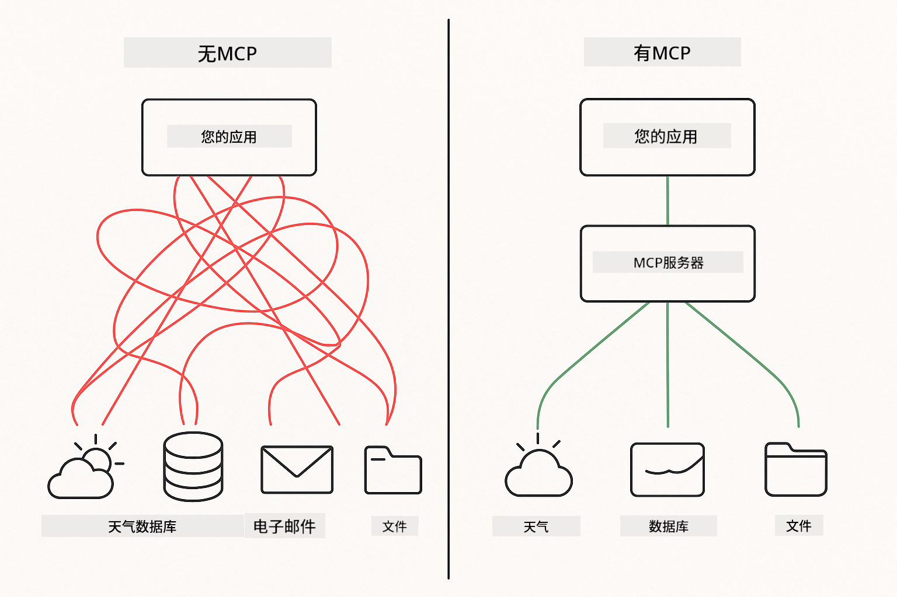

<!--
CO_OP_TRANSLATOR_METADATA:
{
  "original_hash": "c25ec1f10ef156c53e190cdf8b0711ab",
  "translation_date": "2025-12-13T17:40:01+00:00",
  "source_file": "05-mcp/README.md",
  "language_code": "zh"
}
-->
# 模块 05：模型上下文协议 (MCP)

## 目录

- [你将学到什么](../../../05-mcp)
- [理解 MCP](../../../05-mcp)
- [MCP 如何工作](../../../05-mcp)
  - [服务器-客户端架构](../../../05-mcp)
  - [工具发现](../../../05-mcp)
  - [传输机制](../../../05-mcp)
- [先决条件](../../../05-mcp)
- [本模块涵盖内容](../../../05-mcp)
- [快速开始](../../../05-mcp)
  - [示例 1：远程计算器（可流式 HTTP）](../../../05-mcp)
  - [示例 2：文件操作（Stdio）](../../../05-mcp)
  - [示例 3：Git 分析（Docker）](../../../05-mcp)
- [关键概念](../../../05-mcp)
  - [传输选择](../../../05-mcp)
  - [工具发现](../../../05-mcp)
  - [会话管理](../../../05-mcp)
  - [跨平台考虑](../../../05-mcp)
- [何时使用 MCP](../../../05-mcp)
- [MCP 生态系统](../../../05-mcp)
- [恭喜！](../../../05-mcp)
  - [接下来是什么？](../../../05-mcp)
- [故障排除](../../../05-mcp)

## 你将学到什么

你已经构建了对话式 AI，掌握了提示工程，基于文档实现了响应的落地，并创建了带有工具的代理。但所有这些工具都是为你的特定应用定制构建的。如果你能让你的 AI 访问一个任何人都可以创建和共享的标准化工具生态系统呢？

模型上下文协议（MCP）正是提供了这一点——一种标准方式，让 AI 应用发现并使用外部工具。你无需为每个数据源或服务编写定制集成，而是连接到以一致格式暴露其能力的 MCP 服务器。你的 AI 代理即可自动发现并使用这些工具。



*MCP 之前：复杂的点对点集成。MCP 之后：一个协议，无限可能。*

## 理解 MCP

MCP 解决了 AI 开发中的一个根本问题：每个集成都需要定制。想访问 GitHub？定制代码。想读取文件？定制代码。想查询数据库？定制代码。而且这些集成都无法与其他 AI 应用兼容。

MCP 使这一切标准化。MCP 服务器以清晰的描述和模式暴露工具。任何 MCP 客户端都可以连接、发现可用工具并使用它们。一次构建，到处使用。


*模型上下文协议架构——标准化的工具发现与执行*

## MCP 如何工作

**服务器-客户端架构**

MCP 采用客户端-服务器模型。服务器提供工具——读取文件、查询数据库、调用 API。客户端（你的 AI 应用）连接服务器并使用其工具。

**工具发现**

当你的客户端连接到 MCP 服务器时，它会询问“你有哪些工具？”服务器返回可用工具列表，每个工具带有描述和参数模式。你的 AI 代理随后可以根据用户请求决定使用哪些工具。

**传输机制**

MCP 定义了两种传输机制：用于远程服务器的 HTTP，和用于本地进程（包括 Docker 容器）的 Stdio：


*MCP 传输机制：远程服务器使用 HTTP，本地进程（包括 Docker 容器）使用 Stdio*

**可流式 HTTP** - [StreamableHttpDemo.java](../../../05-mcp/src/main/java/com/example/langchain4j/mcp/StreamableHttpDemo.java)

用于远程服务器。你的应用向网络上某处运行的服务器发起 HTTP 请求。使用服务器发送事件（Server-Sent Events）实现实时通信。

```java
McpTransport httpTransport = new StreamableHttpMcpTransport.Builder()
    .url("http://localhost:3001/mcp")
    .timeout(Duration.ofSeconds(60))
    .logRequests(true)
    .logResponses(true)
    .build();
```

> **🤖 试试用 [GitHub Copilot](https://github.com/features/copilot) 聊天：** 打开 [`StreamableHttpDemo.java`](../../../05-mcp/src/main/java/com/example/langchain4j/mcp/StreamableHttpDemo.java) 并提问：
> - “MCP 与模块 04 中的直接工具集成有何不同？”
> - “使用 MCP 进行跨应用工具共享有哪些好处？”
> - “如何处理与 MCP 服务器的连接失败或超时？”

**Stdio** - [StdioTransportDemo.java](../../../05-mcp/src/main/java/com/example/langchain4j/mcp/StdioTransportDemo.java)

用于本地进程。你的应用作为子进程启动服务器，通过标准输入/输出通信。适用于文件系统访问或命令行工具。

```java
McpTransport stdioTransport = new StdioMcpTransport.Builder()
    .command(List.of(
        npmCmd, "exec",
        "@modelcontextprotocol/server-filesystem@0.6.2",
        resourcesDir
    ))
    .logEvents(false)
    .build();
```

> **🤖 试试用 [GitHub Copilot](https://github.com/features/copilot) 聊天：** 打开 [`StdioTransportDemo.java`](../../../05-mcp/src/main/java/com/example/langchain4j/mcp/StdioTransportDemo.java) 并提问：
> - “Stdio 传输如何工作，何时应使用它而非 HTTP？”
> - “LangChain4j 如何管理启动的 MCP 服务器进程的生命周期？”
> - “让 AI 访问文件系统有哪些安全隐患？”

**Docker（使用 Stdio）** - [GitRepositoryAnalyzer.java](../../../05-mcp/src/main/java/com/example/langchain4j/mcp/GitRepositoryAnalyzer.java)

用于容器化服务。通过 `docker run` 使用 stdio 传输与 Docker 容器通信。适合复杂依赖或隔离环境。

```java
McpTransport dockerTransport = new StdioMcpTransport.Builder()
    .command(List.of(
        "docker", "run",
        "-e", "GITHUB_PERSONAL_ACCESS_TOKEN=" + System.getenv("GITHUB_TOKEN"),
        "-v", volumeMapping,
        "-i", "mcp/git"
    ))
    .logEvents(true)
    .build();
```

> **🤖 试试用 [GitHub Copilot](https://github.com/features/copilot) 聊天：** 打开 [`GitRepositoryAnalyzer.java`](../../../05-mcp/src/main/java/com/example/langchain4j/mcp/GitRepositoryAnalyzer.java) 并提问：
> - “Docker 传输如何隔离 MCP 服务器，有何好处？”
> - “如何配置卷挂载以在主机和 MCP 容器间共享数据？”
> - “生产环境中管理基于 Docker 的 MCP 服务器生命周期有哪些最佳实践？”

## 运行示例

### 先决条件

- Java 21+，Maven 3.9+
- Node.js 16+ 和 npm（用于 MCP 服务器）
- **Docker Desktop** - 示例 3 需要 **运行中**（不仅仅是安装）
- 在 `.env` 文件中配置 GitHub 个人访问令牌（来自模块 00）

> **注意：** 如果尚未设置 GitHub 令牌，请参见 [模块 00 - 快速开始](../00-quick-start/README.md) 获取说明。

> **⚠️ Docker 用户：** 运行示例 3 前，请用 `docker ps` 确认 Docker Desktop 正在运行。如果出现连接错误，请启动 Docker Desktop 并等待约 30 秒完成初始化。

## 快速开始

**使用 VS Code：** 在资源管理器中右键点击任意演示文件，选择 **“运行 Java”**，或使用运行和调试面板中的启动配置（确保先将令牌添加到 `.env` 文件）。

**使用 Maven：** 也可以从命令行运行以下示例。

**⚠️ 重要：** 部分示例有先决条件（如启动 MCP 服务器或构建 Docker 镜像）。运行前请检查每个示例的要求。

### 示例 1：远程计算器（可流式 HTTP）

演示基于网络的工具集成。

**⚠️ 先决条件：** 需先启动 MCP 服务器（见下方终端 1）。

**终端 1 - 启动 MCP 服务器：**

**Bash:**
```bash
git clone https://github.com/modelcontextprotocol/servers.git
cd servers/src/everything
npm install
node dist/streamableHttp.js
```

**PowerShell:**
```powershell
git clone https://github.com/modelcontextprotocol/servers.git
cd servers/src/everything
npm install
node dist/streamableHttp.js
```

**终端 2 - 运行示例：**

**使用 VS Code：** 右键点击 `StreamableHttpDemo.java`，选择 **“运行 Java”**。

**使用 Maven：**

**Bash:**
```bash
export GITHUB_TOKEN=your_token_here
cd 05-mcp
mvn compile exec:java -Dexec.mainClass=com.example.langchain4j.mcp.StreamableHttpDemo
```

**PowerShell:**
```powershell
$env:GITHUB_TOKEN=your_token_here
cd 05-mcp
mvn --% compile exec:java -Dexec.mainClass=com.example.langchain4j.mcp.StreamableHttpDemo
```

观察代理发现可用工具，然后使用计算器执行加法。

### 示例 2：文件操作（Stdio）

演示基于本地子进程的工具。

**✅ 无需先决条件** - MCP 服务器会自动启动。

**使用 VS Code：** 右键点击 `StdioTransportDemo.java`，选择 **“运行 Java”**。

**使用 Maven：**

**Bash:**
```bash
export GITHUB_TOKEN=your_token_here
cd 05-mcp
mvn compile exec:java -Dexec.mainClass=com.example.langchain4j.mcp.StdioTransportDemo
```

**PowerShell:**
```powershell
$env:GITHUB_TOKEN=your_token_here
cd 05-mcp
mvn --% compile exec:java -Dexec.mainClass=com.example.langchain4j.mcp.StdioTransportDemo
```

应用自动启动文件系统 MCP 服务器并读取本地文件。注意子进程管理是如何为你处理的。

**预期输出：**
```
Assistant response: The content of the file is "Kaboom!".
```

### 示例 3：Git 分析（Docker）

演示容器化工具服务器。

**⚠️ 先决条件：**  
1. **Docker Desktop 必须运行中**（不仅仅是安装）  
2. **Windows 用户：** 推荐使用 WSL 2 模式（Docker Desktop 设置 → 常规 → “使用基于 WSL 2 的引擎”）。Hyper-V 模式需要手动配置文件共享。  
3. 需先构建 Docker 镜像（见下方终端 1）

**验证 Docker 是否运行：**

**Bash:**
```bash
docker ps  # 应显示容器列表，而不是错误
```

**PowerShell:**
```powershell
docker ps  # 应显示容器列表，而不是错误
```

如果出现“无法连接到 Docker 守护进程”或“系统找不到指定的文件”等错误，请启动 Docker Desktop 并等待初始化（约 30 秒）。

**故障排除：**  
- 如果 AI 报告仓库为空或无文件，说明卷挂载（`-v`）未生效。  
- **Windows Hyper-V 用户：** 将项目目录添加到 Docker Desktop 设置 → 资源 → 文件共享，然后重启 Docker Desktop。  
- **推荐方案：** 切换到 WSL 2 模式实现自动文件共享（设置 → 常规 → 启用“使用基于 WSL 2 的引擎”）。

**终端 1 - 构建 Docker 镜像：**

**Bash:**
```bash
cd servers/src/git
docker build -t mcp/git .
```

**PowerShell:**
```powershell
cd servers/src/git
docker build -t mcp/git .
```

**终端 2 - 运行分析器：**

**使用 VS Code：** 右键点击 `GitRepositoryAnalyzer.java`，选择 **“运行 Java”**。

**使用 Maven：**

**Bash:**
```bash
export GITHUB_TOKEN=your_token_here
cd 05-mcp
mvn compile exec:java -Dexec.mainClass=com.example.langchain4j.mcp.GitRepositoryAnalyzer
```

**PowerShell:**
```powershell
$env:GITHUB_TOKEN=your_token_here
cd 05-mcp
mvn --% compile exec:java -Dexec.mainClass=com.example.langchain4j.mcp.GitRepositoryAnalyzer
```

应用启动 Docker 容器，挂载你的仓库，并通过 AI 代理分析仓库结构和内容。

## 关键概念

**传输选择**

根据工具所在位置选择：  
- 远程服务 → 可流式 HTTP  
- 本地文件系统 → Stdio  
- 复杂依赖 → Docker

**工具发现**

MCP 客户端连接时自动发现可用工具。你的 AI 代理看到工具描述，并根据用户请求决定使用哪些工具。

**会话管理**

可流式 HTTP 传输支持会话，允许与远程服务器进行有状态交互。Stdio 和 Docker 传输通常是无状态的。

**跨平台考虑**

示例自动处理平台差异（Windows 与 Unix 命令差异、Docker 路径转换）。这对跨环境生产部署非常重要。

## 何时使用 MCP

**使用 MCP 的场景：**  
- 想利用现有工具生态系统  
- 构建多个应用将使用的工具  
- 通过标准协议集成第三方服务  
- 需要无需代码更改即可替换工具实现

**使用自定义工具（模块 04）的场景：**  
- 构建应用特定功能  
- 性能关键（MCP 有额外开销）  
- 工具简单且不会复用  
- 需要完全控制执行过程

## MCP 生态系统

模型上下文协议是一个开放标准，拥有不断增长的生态系统：

- 官方 MCP 服务器，支持常见任务（文件系统、Git、数据库）  
- 社区贡献的各种服务服务器  
- 标准化的工具描述和模式  
- 跨框架兼容（适用于任何 MCP 客户端）

这种标准化意味着为一个 AI 应用构建的工具也能用于其他应用，形成共享的能力生态。

## 恭喜！

你已完成 LangChain4j 初学者课程。你学到了：

- 如何构建带记忆的对话式 AI（模块 01）  
- 不同任务的提示工程模式（模块 02）  
- 使用 RAG 让响应基于文档（模块 03）  
- 创建带自定义工具的 AI 代理（模块 04）  
- 通过 MCP 集成标准化工具（模块 05）

你现在具备构建生产级 AI 应用的基础。所学概念不依赖具体框架或模型，是 AI 工程的基本模式。

### 接下来是什么？

完成模块后，探索 [测试指南](../docs/TESTING.md)，了解 LangChain4j 测试概念的实际应用。

**官方资源：**  
- [LangChain4j 文档](https://docs.langchain4j.dev/) - 全面指南和 API 参考  
- [LangChain4j GitHub](https://github.com/langchain4j/langchain4j) - 源代码和示例  
- [LangChain4j 教程](https://docs.langchain4j.dev/tutorials/) - 各种用例的分步教程

感谢你完成本课程！

---

**导航：** [← 上一章：模块 04 - 工具](../04-tools/README.md) | [返回主页](../README.md)

---

## 故障排除

### PowerShell Maven 命令语法
**问题**：Maven 命令失败，报错 `Unknown lifecycle phase ".mainClass=..."`

**原因**：PowerShell 将 `=` 解释为变量赋值操作符，导致 Maven 属性语法错误

**解决方案**：在 Maven 命令前使用停止解析操作符 `--%`：

**PowerShell:**
```powershell
mvn --% compile exec:java -Dexec.mainClass=com.example.langchain4j.mcp.StreamableHttpDemo
```

**Bash:**
```bash
mvn compile exec:java -Dexec.mainClass=com.example.langchain4j.mcp.StreamableHttpDemo
```

`--%` 操作符告诉 PowerShell 将后续所有参数原样传递给 Maven，不进行解析。

### Docker 连接问题

**问题**：Docker 命令失败，提示“Cannot connect to Docker daemon”或“The system cannot find the file specified”

**原因**：Docker Desktop 未启动或未完全初始化

**解决方案**： 
1. 启动 Docker Desktop
2. 等待约 30 秒以完成初始化
3. 使用 `docker ps` 验证（应显示容器列表，而非错误）
4. 然后运行你的示例

### Windows Docker 卷挂载

**问题**：Git 仓库分析器报告仓库为空或无文件

**原因**：卷挂载（`-v`）因文件共享配置问题无法正常工作

**解决方案**：
- **推荐：** 切换到 WSL 2 模式（Docker Desktop 设置 → 常规 → “使用基于 WSL 2 的引擎”）
- **备选（Hyper-V）：** 将项目目录添加到 Docker Desktop 设置 → 资源 → 文件共享，然后重启 Docker Desktop

---

<!-- CO-OP TRANSLATOR DISCLAIMER START -->
**免责声明**：  
本文件由人工智能翻译服务 [Co-op Translator](https://github.com/Azure/co-op-translator) 翻译而成。虽然我们力求准确，但请注意自动翻译可能存在错误或不准确之处。原始文件的母语版本应被视为权威来源。对于重要信息，建议使用专业人工翻译。我们不对因使用本翻译而产生的任何误解或误释承担责任。
<!-- CO-OP TRANSLATOR DISCLAIMER END -->