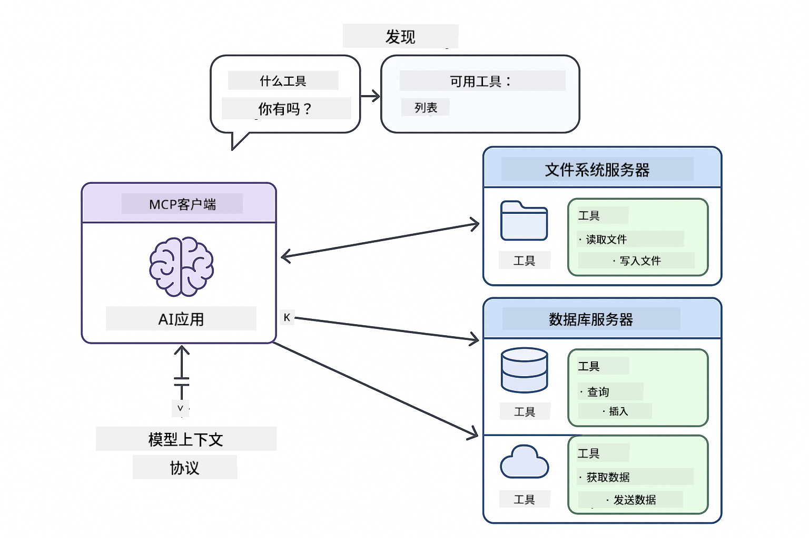
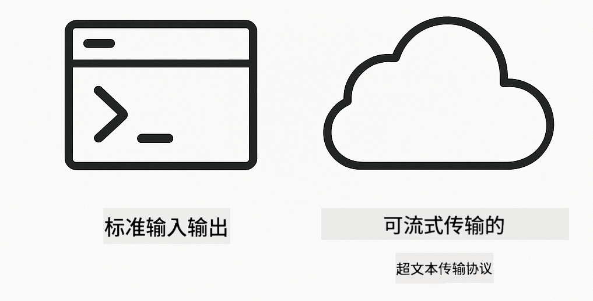
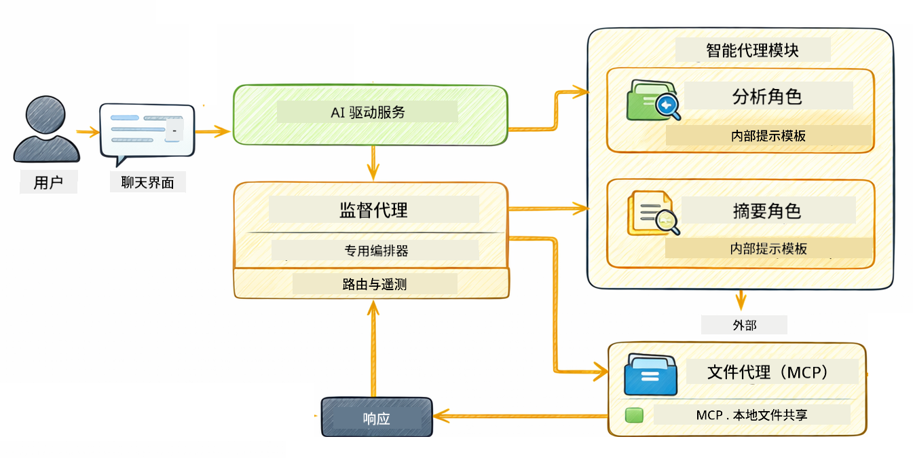

<!--
CO_OP_TRANSLATOR_METADATA:
{
  "original_hash": "6c816d130a1fa47570c11907e72d84ae",
  "translation_date": "2026-01-05T21:53:58+00:00",
  "source_file": "05-mcp/README.md",
  "language_code": "zh"
}
-->
# 模块 05：模型上下文协议（MCP）

## 目录

- [你将学到什么](../../../05-mcp)
- [什么是 MCP？](../../../05-mcp)
- [MCP 的工作原理](../../../05-mcp)
- [Agentic 模块](../../../05-mcp)
- [运行示例](../../../05-mcp)
  - [先决条件](../../../05-mcp)
- [快速开始](../../../05-mcp)
  - [文件操作（Stdio）](../../../05-mcp)
  - [监督代理](../../../05-mcp)
    - [理解输出](../../../05-mcp)
    - [响应策略](../../../05-mcp)
    - [Agentic 模块特性的说明](../../../05-mcp)
- [关键概念](../../../05-mcp)
- [恭喜！](../../../05-mcp)
  - [接下来是什么？](../../../05-mcp)

## 你将学到什么

你已经构建了对话式 AI，掌握了提示，基于文档实现了有根据的回答，并创建了带工具的代理。但所有这些工具都是针对你的具体应用定制构建的。如果你能让你的 AI 访问一个任何人都能创建和共享的标准化工具生态系统，会怎样呢？在本模块中，你将学习如何使用模型上下文协议（MCP）和 LangChain4j 的 agentic 模块做到这一点。我们先展示一个简单的 MCP 文件读取器，然后展示如何将其轻松集成到使用监督代理模式的高级 agentic 工作流中。

## 什么是 MCP？

模型上下文协议（MCP）正是提供了这样一个标准方式，让 AI 应用可以发现和使用外部工具。不必为每个数据源或服务编写定制集成，而是连接到以一致格式公开其功能的 MCP 服务器。你的 AI 代理随后可以自动发现并使用这些工具。


*MCP 之前：复杂的点对点集成。MCP 之后：一种协议，无限可能。*

MCP 解决了 AI 开发中的一个根本问题：每个集成都很定制。想访问 GitHub？定制代码。想读取文件？定制代码。想查询数据库？定制代码。而且这些集成都无法被其他 AI 应用使用。

MCP 标准化了这一点。MCP 服务器公开工具，附带清晰的描述和模式。任何 MCP 客户端都可以连接，发现可用工具，并使用它们。一次构建，到处使用。



*模型上下文协议架构——标准化的工具发现与执行*

## MCP 的工作原理

**服务器-客户端架构**

MCP 使用客户端-服务器模型。服务器提供工具——读取文件、查询数据库、调用 API。客户端（你的 AI 应用）连接服务器并使用其工具。

要在 LangChain4j 中使用 MCP，添加以下 Maven 依赖：

```xml
<dependency>
    <groupId>dev.langchain4j</groupId>
    <artifactId>langchain4j-mcp</artifactId>
    <version>${langchain4j.version}</version>
</dependency>
```

**工具发现**

当你的客户端连接到 MCP 服务器时，会询问“你有哪些工具？”服务器会返回一份可用工具列表，每个工具都有说明和参数模式。你的 AI 代理可以基于用户请求决定使用哪些工具。

**传输机制**

MCP 支持多种传输机制。本模块演示了用于本地进程的 Stdio 传输：



*MCP 传输机制：远程服务器用 HTTP，本地进程用 Stdio*

**Stdio** - [StdioTransportDemo.java](../../../05-mcp/src/main/java/com/example/langchain4j/mcp/StdioTransportDemo.java)

针对本地进程。你的应用作为子进程启动服务器，并通过标准输入/输出通信。适合访问文件系统或命令行工具。

```java
McpTransport stdioTransport = new StdioMcpTransport.Builder()
    .command(List.of(
        npmCmd, "exec",
        "@modelcontextprotocol/server-filesystem@2025.12.18",
        resourcesDir
    ))
    .logEvents(false)
    .build();
```

> **🤖 试试 [GitHub Copilot](https://github.com/features/copilot) Chat：** 打开 [`StdioTransportDemo.java`](../../../05-mcp/src/main/java/com/example/langchain4j/mcp/StdioTransportDemo.java) 并提问：
> - “Stdio 传输如何工作？我该何时使用它而非 HTTP？”
> - “LangChain4j 如何管理启动的 MCP 服务器进程的生命周期？”
> - “给予 AI 访问文件系统权限有哪些安全隐患？”

## Agentic 模块

虽然 MCP 提供了标准化工具，LangChain4j 的**agentic 模块**则提供了一种声明式方式来构建管理这些工具的代理。`@Agent` 注解和 `AgenticServices` 让你通过接口定义代理行为，而非命令式代码。

本模块中，你将探索**监督代理**模式——一种高级的 agentic AI 方法，其中“监督”代理基于用户请求动态决定调用哪些子代理。我们将结合这两个概念，为我们的一个子代理赋予 MCP 驱动的文件访问能力。

使用 agentic 模块，需要添加以下 Maven 依赖：

```xml
<dependency>
    <groupId>dev.langchain4j</groupId>
    <artifactId>langchain4j-agentic</artifactId>
    <version>${langchain4j.mcp.version}</version>
</dependency>
```

> **⚠️ 实验性：** `langchain4j-agentic` 模块为**实验性**，可能会变动。构建 AI 助手的稳定方式仍是使用 `langchain4j-core` 和自定义工具（模块 04）。

## 运行示例

### 先决条件

- Java 21+，Maven 3.9+
- Node.js 16+ 和 npm（用于 MCP 服务器）
- 在 `.env` 文件中配置环境变量（位于根目录）：
  - `AZURE_OPENAI_ENDPOINT`、`AZURE_OPENAI_API_KEY`、`AZURE_OPENAI_DEPLOYMENT`（与模块 01-04 相同）

> **注意：** 如果尚未设置环境变量，请参阅[模块 00 - 快速开始](../00-quick-start/README.md)获取说明，或者复制根目录下的 `.env.example` 为 `.env` 并填写你的值。

## 快速开始

**使用 VS Code：** 只需在资源管理器中右键任何示例文件，选择 **“Run Java”**，或通过运行和调试面板使用启动配置（确保先将令牌添加到 `.env` 文件中）。

**使用 Maven：** 或者，你也可以在命令行使用下面的示例运行。

### 文件操作（Stdio）

演示基于本地子进程的工具。

**✅ 无需先决条件** —— MCP 服务器会自动启动。

**使用启动脚本（推荐）：**

启动脚本会自动从根目录 `.env` 文件加载环境变量：

**Bash：**
```bash
cd 05-mcp
chmod +x start-stdio.sh
./start-stdio.sh
```

**PowerShell：**
```powershell
cd 05-mcp
.\start-stdio.ps1
```

**使用 VS Code：** 右键 `StdioTransportDemo.java`，选择 **“Run Java”**（确保已经配置 `.env` 文件）。

应用会自动启动文件系统 MCP 服务器并读取本地文件。注意子进程管理已为你处理。

**预期输出：**
```
Assistant response: The file provides an overview of LangChain4j, an open-source Java library
for integrating Large Language Models (LLMs) into Java applications...
```

### 监督代理

**监督代理模式**是一种**灵活**的 agentic AI 形式。监督代理使用 LLM 自主决定基于用户请求调用哪些代理。在下一个示例中，我们结合 MCP 驱动的文件访问与 LLM 代理，创建一个监督的“读取文件 → 生成报告”工作流。

演示中，`FileAgent` 使用 MCP 文件系统工具读取文件，`ReportAgent` 生成结构化报告，包括执行摘要（一句）、3 个关键点和建议。监督者自动协调该流程：



```
┌─────────────┐      ┌──────────────┐
│  FileAgent  │ ───▶ │ ReportAgent  │
│ (MCP tools) │      │  (pure LLM)  │
└─────────────┘      └──────────────┘
   outputKey:           outputKey:
  'fileContent'         'report'
```

每个代理将输出存储于**Agentic Scope**（共享内存）中，允许后续代理访问之前结果。这展示了 MCP 工具如何无缝融入 agentic 工作流——监督者无需了解文件如何被读取，只需知道 `FileAgent` 能做到。

#### 运行演示

启动脚本会自动从根目录 `.env` 文件加载环境变量：

**Bash：**
```bash
cd 05-mcp
chmod +x start-supervisor.sh
./start-supervisor.sh
```

**PowerShell：**
```powershell
cd 05-mcp
.\start-supervisor.ps1
```

**使用 VS Code：** 右键 `SupervisorAgentDemo.java`，选择 **“Run Java”**（确保已配置 `.env` 文件）。

#### 监督者的工作原理

```java
// 第一步：FileAgent 使用 MCP 工具读取文件
FileAgent fileAgent = AgenticServices.agentBuilder(FileAgent.class)
        .chatModel(model)
        .toolProvider(mcpToolProvider)  // 拥有用于文件操作的 MCP 工具
        .build();

// 第二步：ReportAgent 生成结构化报告
ReportAgent reportAgent = AgenticServices.agentBuilder(ReportAgent.class)
        .chatModel(model)
        .build();

// 监督者协调文件到报告的工作流程
SupervisorAgent supervisor = AgenticServices.supervisorBuilder()
        .chatModel(model)
        .subAgents(fileAgent, reportAgent)
        .responseStrategy(SupervisorResponseStrategy.LAST)  // 返回最终报告
        .build();

// 监督者根据请求决定调用哪些代理
String response = supervisor.invoke("Read the file at /path/file.txt and generate a report");
```

#### 响应策略

配置 `SupervisorAgent` 时，你需指定在子代理完成任务后如何形成最终回答。可用策略如下：

| 策略 | 描述 |
|----------|-------------|
| **LAST** | 监督者返回最后调用的子代理或工具的输出。当工作流最后的代理专门设计为生成完整最终答案（例如，研究流程中的“摘要代理”）时，此策略非常有用。 |
| **SUMMARY** | 监督者使用其内部语言模型（LLM）综合整个交互及所有子代理输出的总结，然后以该总结作为最终响应。这为用户提供了清晰、汇总的答案。 |
| **SCORED** | 系统使用内部 LLM 根据原始用户请求对 LAST 响应和 SUMMARY 内容进行评分，返回得分更高的输出。 |

完整实现见 [SupervisorAgentDemo.java](../../../05-mcp/src/main/java/com/example/langchain4j/mcp/SupervisorAgentDemo.java)。

> **🤖 试试 [GitHub Copilot](https://github.com/features/copilot) Chat：** 打开 [`SupervisorAgentDemo.java`](../../../05-mcp/src/main/java/com/example/langchain4j/mcp/SupervisorAgentDemo.java) 并提问：
> - “监督者如何决定调用哪些代理？”
> - “监督者和顺序工作流模式的区别是什么？”
> - “我如何自定义监督者的规划行为？”

#### 理解输出

运行演示时，你会看到监督者如何协调多个代理的结构化步步演示。以下是每部分含义：

```
======================================================================
  FILE → REPORT WORKFLOW DEMO
======================================================================

This demo shows a clear 2-step workflow: read a file, then generate a report.
The Supervisor orchestrates the agents automatically based on the request.
```

**标题**介绍了工作流概念：从文件读取到报告生成的聚焦管道。

```
--- WORKFLOW ---------------------------------------------------------
  ┌─────────────┐      ┌──────────────┐
  │  FileAgent  │ ───▶ │ ReportAgent  │
  │ (MCP tools) │      │  (pure LLM)  │
  └─────────────┘      └──────────────┘
   outputKey:           outputKey:
   'fileContent'        'report'

--- AVAILABLE AGENTS -------------------------------------------------
  [FILE]   FileAgent   - Reads files via MCP → stores in 'fileContent'
  [REPORT] ReportAgent - Generates structured report → stores in 'report'
```

**工作流图**展示了代理间的数据流。每个代理有特定角色：
- **FileAgent** 使用 MCP 工具读取文件并将原始内容存入 `fileContent`
- **ReportAgent** 使用该内容生成结构化报告存入 `report`

```
--- USER REQUEST -----------------------------------------------------
  "Read the file at .../file.txt and generate a report on its contents"
```

**用户请求**展示了任务。监督者解析请求并决定依次调用 FileAgent → ReportAgent。

```
--- SUPERVISOR ORCHESTRATION -----------------------------------------
  The Supervisor decides which agents to invoke and passes data between them...

  +-- STEP 1: Supervisor chose -> FileAgent (reading file via MCP)
  |
  |   Input: .../file.txt
  |
  |   Result: LangChain4j is an open-source, provider-agnostic Java framework for building LLM...
  +-- [OK] FileAgent (reading file via MCP) completed

  +-- STEP 2: Supervisor chose -> ReportAgent (generating structured report)
  |
  |   Input: LangChain4j is an open-source, provider-agnostic Java framew...
  |
  |   Result: Executive Summary...
  +-- [OK] ReportAgent (generating structured report) completed
```

**监督者协调**展示了两步流程：
1. **FileAgent** 通过 MCP 读取文件并存储内容
2. **ReportAgent** 接收内容生成结构化报告

监督者基于用户请求**自主**做出这些决策。

```
--- FINAL RESPONSE ---------------------------------------------------
Executive Summary
...

Key Points
...

Recommendations
...

--- AGENTIC SCOPE (Data Flow) ----------------------------------------
  Each agent stores its output for downstream agents to consume:
  * fileContent: LangChain4j is an open-source, provider-agnostic Java framework...
  * report: Executive Summary...
```

#### Agentic 模块特性的说明

示例演示了 agentic 模块的多个高级功能。我们重点看看 Agentic Scope 和 Agent 监听器。

**Agentic Scope** 是代理存储结果的共享内存，通过 `@Agent(outputKey="...")` 实现。这允许：
- 后续代理访问前面代理的输出
- 监督者综合形成最终响应
- 检查每个代理产出的内容

```java
ResultWithAgenticScope<String> result = supervisor.invokeWithAgenticScope(request);
AgenticScope scope = result.agenticScope();
String fileContent = scope.readState("fileContent");  // 来自FileAgent的原始文件数据
String report = scope.readState("report");            // 来自ReportAgent的结构化报告
```

**Agent 监听器**支持监控和调试代理执行。演示中的逐步骤输出来自一个挂接到每次代理调用的 AgentListener：
- **beforeAgentInvocation** - 监督者选择代理时调用，可查看所选代理及原因
- **afterAgentInvocation** - 代理完成时调用，显示结果
- **inheritedBySubagents** - 设置为 true 时监听整个代理层级的所有代理

```java
AgentListener monitor = new AgentListener() {
    private int step = 0;
    
    @Override
    public void beforeAgentInvocation(AgentRequest request) {
        step++;
        System.out.println("  +-- STEP " + step + ": " + request.agentName());
    }
    
    @Override
    public void afterAgentInvocation(AgentResponse response) {
        System.out.println("  +-- [OK] " + response.agentName() + " completed");
    }
    
    @Override
    public boolean inheritedBySubagents() {
        return true; // 传播到所有子代理
    }
};
```

除了监督模式，`langchain4j-agentic` 模块还提供多种强大工作流模式和特性：

| 模式 | 描述 | 适用场景 |
|---------|-------------|----------|
| **顺序执行** | 按顺序执行代理，输出传递到下一个 | 流水线：研究 → 分析 → 报告 |
| **并行执行** | 同时运行代理 | 独立任务：天气 + 新闻 + 股票 |
| **循环** | 迭代直到满足条件 | 质量评分：反复优化直到分数≥0.8 |
| **条件分支** | 按条件路径分流 | 分类 → 路由到专门代理 |
| **人机协作** | 增加人工检查点 | 审批流程，内容审核 |

## 关键概念

既然你已经实际探索了 MCP 和 agentic 模块，让我们总结何时使用哪个方案。

**MCP** 适合当你想利用现有工具生态系统、构建多个应用可共享的工具、用标准协议集成第三方服务，或无需改代码即可切换工具实现时。

**Agentic 模块** 最适合你想用声明式接口定义代理 (`@Agent` 注解)、需要工作流编排（顺序、循环、并行）、偏好接口化设计而非命令式代码，或希望多个代理共享输出（`outputKey`）时。

**监督代理模式** 适合当工作流无法提前预测、希望让 LLM 决策、拥有多个专门代理需要动态编排、构建路由不同功能的对话系统，或需要最灵活、自适应的代理行为时。
## 恭喜！

您已经完成了 LangChain4j 入门课程。您已经学会了：

- 如何构建带有记忆的对话式 AI（模块 01）
- 不同任务的提示工程模式（模块 02）
- 使用 RAG 让响应基于您的文档（模块 03）
- 使用自定义工具创建基本的 AI 代理（助手）（模块 04）
- 使用 LangChain4j MCP 和 Agentic 模块集成标准化工具（模块 05）

### 接下来做什么？

完成模块后，探索[测试指南](../docs/TESTING.md)，了解 LangChain4j 测试概念的实际应用。

**官方资源：**
- [LangChain4j 文档](https://docs.langchain4j.dev/) - 综合指南和 API 参考
- [LangChain4j GitHub](https://github.com/langchain4j/langchain4j) - 源代码和示例
- [LangChain4j 教程](https://docs.langchain4j.dev/tutorials/) - 各种用例的逐步教程

感谢您完成本课程！

---

**导航：** [← 上一节：模块 04 - 工具](../04-tools/README.md) | [返回主页](../README.md)

---

<!-- CO-OP TRANSLATOR DISCLAIMER START -->
**免责声明**：  
本文件由人工智能翻译服务 [Co-op Translator](https://github.com/Azure/co-op-translator) 翻译。尽管我们力求准确，但请注意，自动翻译可能包含错误或不准确之处。原始语言的文件应被视为权威来源。对于关键信息，建议使用专业人工翻译。我们不对因使用此翻译而引起的任何误解或误释承担责任。
<!-- CO-OP TRANSLATOR DISCLAIMER END -->