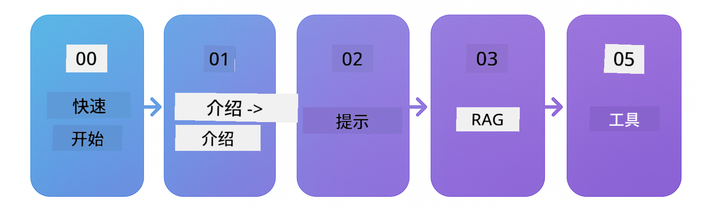

<!--
CO_OP_TRANSLATOR_METADATA:
{
  "original_hash": "69c7e2616c66df6cc296492fbfcad9ec",
  "translation_date": "2025-12-13T12:17:47+00:00",
  "source_file": "README.md",
  "language_code": "zh"
}
-->

# LangChain4j 初学者指南

使用 LangChain4j 和 Azure OpenAI GPT-5 构建 AI 应用的课程，从基础聊天到 AI 代理。

**LangChain4j 新手？** 请查看 [术语表](docs/GLOSSARY.md) 了解关键术语和概念的定义。

## 目录

1. [快速开始](00-quick-start/README.md) - 快速上手 LangChain4j
2. [介绍](01-introduction/README.md) - 学习 LangChain4j 基础知识
3. [提示工程](02-prompt-engineering/README.md) - 掌握有效的提示设计
4. [RAG（检索增强生成）](03-rag/README.md) - 构建智能知识系统
5. [工具](04-tools/README.md) - 将外部工具和 API 集成到 AI 代理中
6. [MCP（模型上下文协议）](05-mcp/README.md) - 使用模型上下文协议
---

## 学习路径

从 [快速开始](00-quick-start/README.md) 模块开始，逐步完成每个模块，逐步提升技能。你将尝试基础示例以理解基本原理，然后进入 [介绍](01-introduction/README.md) 模块，深入了解 GPT-5。

完成所有模块后，探索 [测试指南](docs/TESTING.md)，了解 LangChain4j 测试概念的实际应用。

> **注意：** 本培训同时使用 GitHub 模型和 Azure OpenAI。[快速开始](00-quick-start/README.md) 和 [MCP](05-mcp/README.md) 模块使用 GitHub 模型（无需 Azure 订阅），而模块 1-4 使用 Azure OpenAI GPT-5。

## 使用 GitHub Copilot 学习

要快速开始编码，请在 GitHub Codespace 或本地 IDE 中打开此项目，使用提供的 devcontainer。本课程使用的 devcontainer 预配置了 GitHub Copilot，用于 AI 配对编程。

每个代码示例都包含你可以问 GitHub Copilot 的建议问题，帮助你加深理解。请留意以下位置的 💡/🤖 提示：

- **Java 文件头部** - 针对每个示例的具体问题
- **模块 README** - 代码示例后的探索提示

**使用方法：** 打开任意代码文件，向 Copilot 提出建议的问题。它拥有完整的代码库上下文，可以解释、扩展并提出替代方案。

想了解更多？请查看 [AI 配对编程的 Copilot](https://aka.ms/GitHubCopilotAI)。

## 额外资源

### LangChain

---

### Azure / Edge / MCP / 代理

---

### 生成式 AI 系列

[-9333EA?style=for-the-badge&labelColor=E5E7EB&color=9333EA)](https://github.com/microsoft/Generative-AI-for-beginners-dotnet?WT.mc_id=academic-105485-koreyst)
[-C084FC?style=for-the-badge&labelColor=E5E7EB&color=C084FC)](https://github.com/microsoft/generative-ai-for-beginners-java?WT.mc_id=academic-105485-koreyst)
[-E879F9?style=for-the-badge&labelColor=E5E7EB&color=E879F9)](https://github.com/microsoft/generative-ai-with-javascript?WT.mc_id=academic-105485-koreyst)

---

### 核心学习

---

### Copilot 系列

## 获取帮助

如果遇到困难或有任何关于构建 AI 应用的问题，请加入：

如果在构建过程中有产品反馈或错误，请访问：

## 许可证

MIT 许可证 - 详情请参见 [LICENSE](../../LICENSE) 文件。

---

<!-- CO-OP TRANSLATOR DISCLAIMER START -->
**免责声明**：  
本文件由人工智能翻译服务[Co-op Translator](https://github.com/Azure/co-op-translator)翻译而成。虽然我们力求准确，但请注意自动翻译可能存在错误或不准确之处。原始文件的母语版本应被视为权威来源。对于重要信息，建议使用专业人工翻译。因使用本翻译而产生的任何误解或误释，我们概不负责。
<!-- CO-OP TRANSLATOR DISCLAIMER END -->