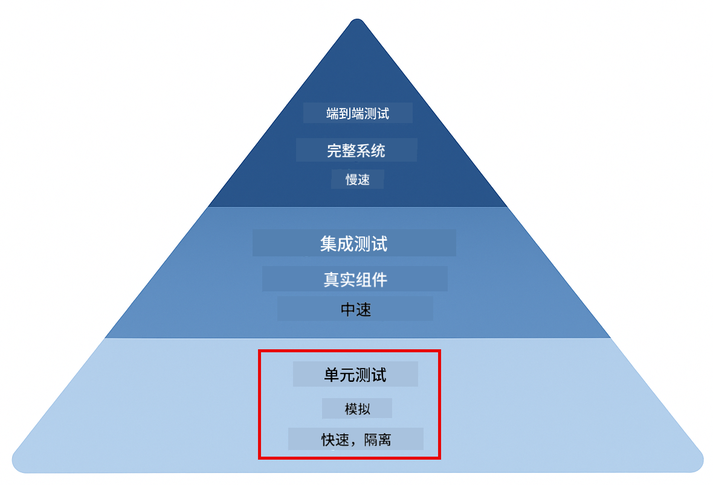
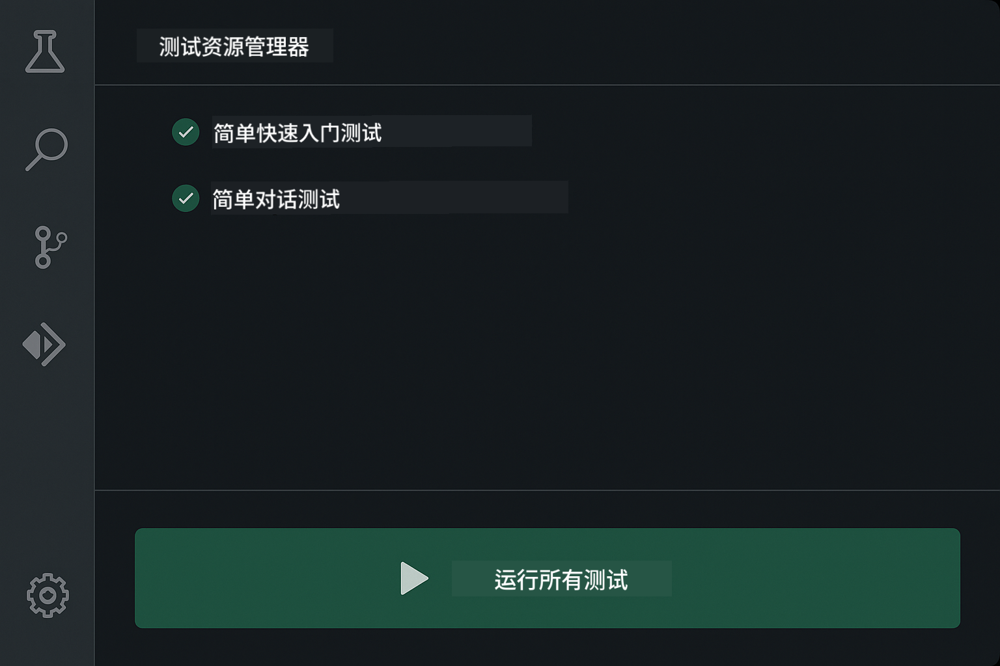
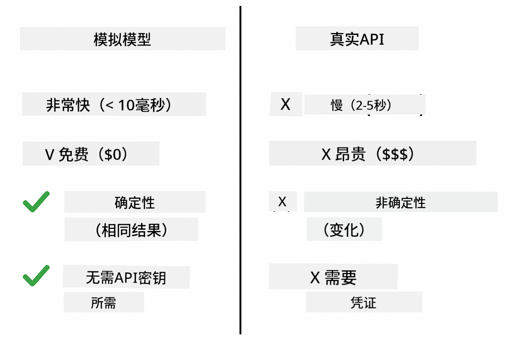
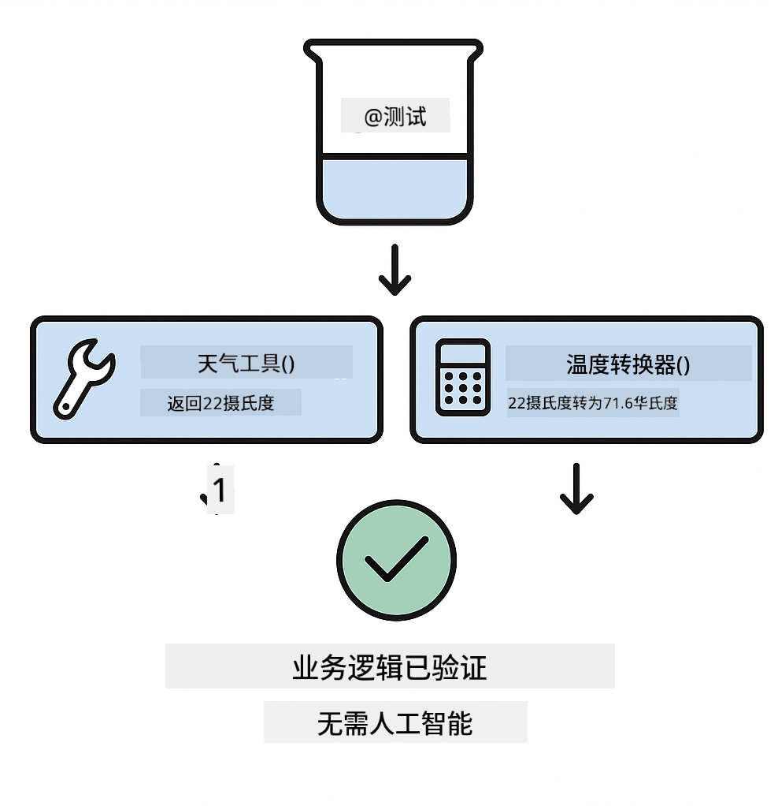
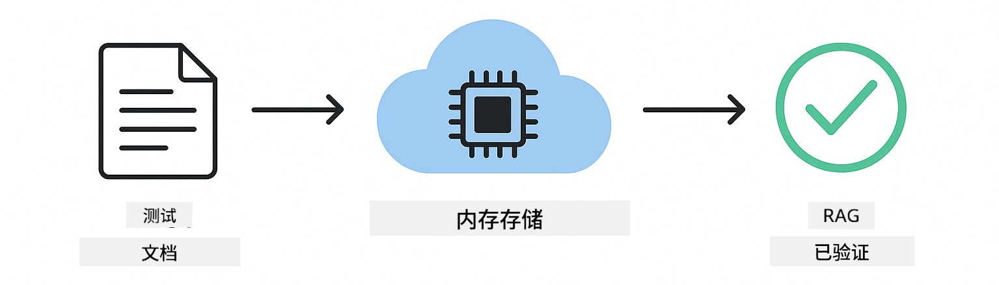
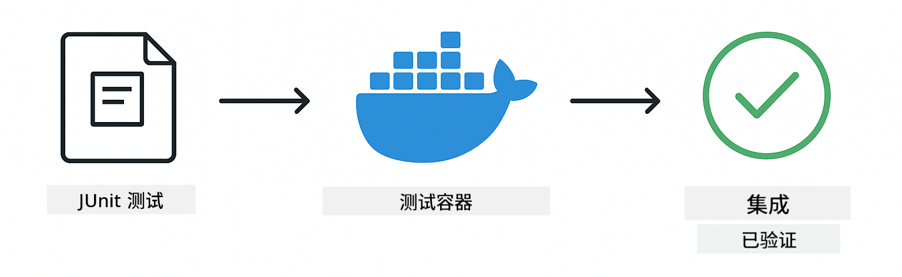

<!--
CO_OP_TRANSLATOR_METADATA:
{
  "original_hash": "b975537560c404d5f254331832811e78",
  "translation_date": "2025-12-13T20:40:57+00:00",
  "source_file": "docs/TESTING.md",
  "language_code": "zh"
}
-->
# 测试 LangChain4j 应用程序

## 目录

- [快速开始](../../../docs)
- [测试内容](../../../docs)
- [运行测试](../../../docs)
- [在 VS Code 中运行测试](../../../docs)
- [测试模式](../../../docs)
- [测试理念](../../../docs)
- [下一步](../../../docs)

本指南将引导您了解演示如何测试 AI 应用程序的测试，且无需 API 密钥或外部服务。

## 快速开始

使用单条命令运行所有测试：

**Bash:**
```bash
mvn test
```

**PowerShell:**
```powershell
mvn --% test
```


*成功执行测试，显示所有测试通过且无失败*

## 测试内容

本课程侧重于本地运行的**单元测试**。每个测试演示了一个独立的 LangChain4j 概念。



*测试金字塔展示了单元测试（快速、独立）、集成测试（真实组件）和端到端测试（使用 Docker 的完整系统）之间的平衡。本培训涵盖单元测试。*

| 模块 | 测试数 | 重点 | 关键文件 |
|--------|-------|-------|-----------|
| **00 - 快速开始** | 6 | 提示模板和变量替换 | `SimpleQuickStartTest.java` |
| **01 - 介绍** | 8 | 会话记忆和有状态聊天 | `SimpleConversationTest.java` |
| **02 - 提示工程** | 12 | GPT-5 模式、急切级别、结构化输出 | `SimpleGpt5PromptTest.java` |
| **03 - RAG** | 10 | 文档摄取、嵌入、相似度搜索 | `DocumentServiceTest.java` |
| **04 - 工具** | 12 | 函数调用和工具链 | `SimpleToolsTest.java` |
| **05 - MCP** | 15 | 使用 Docker 的模型上下文协议 | `SimpleMcpTest.java`, `McpDockerTransportTest.java` |

## 运行测试

**从根目录运行所有测试：**

**Bash:**
```bash
mvn test
```

**PowerShell:**
```powershell
mvn --% test
```

**运行特定模块的测试：**

**Bash:**
```bash
cd 01-introduction && mvn test
# 或者从根目录开始
mvn test -pl 01-introduction
```

**PowerShell:**
```powershell
cd 01-introduction; mvn --% test
# 或者从根目录开始
mvn --% test -pl 01-introduction
```

**运行单个测试类：**

**Bash:**
```bash
mvn test -Dtest=SimpleConversationTest
```

**PowerShell:**
```powershell
mvn --% test -Dtest=SimpleConversationTest
```

**运行特定测试方法：**

**Bash:**
```bash
mvn test -Dtest=SimpleConversationTest#是否应保持对话历史
```

**PowerShell:**
```powershell
mvn --% test -Dtest=SimpleConversationTest#是否应保持对话历史
```

## 在 VS Code 中运行测试

如果您使用 Visual Studio Code，测试资源管理器提供了图形界面来运行和调试测试。



*VS Code 测试资源管理器显示所有 Java 测试类和单个测试方法的测试树*

**在 VS Code 中运行测试：**

1. 点击活动栏中的烧杯图标打开测试资源管理器
2. 展开测试树查看所有模块和测试类
3. 点击任意测试旁的播放按钮单独运行该测试
4. 点击“运行所有测试”执行整个测试套件
5. 右键点击任意测试，选择“调试测试”以设置断点并逐步调试代码

测试资源管理器用绿色勾号显示通过的测试，失败时提供详细的失败信息。

## 测试模式


*LangChain4j 应用的六种测试模式：提示模板、模型模拟、会话隔离、工具测试、内存中 RAG 和 Docker 集成*

### 模式 1：测试提示模板

最简单的模式是测试提示模板，不调用任何 AI 模型。您验证变量替换是否正确，提示格式是否符合预期。


*测试提示模板，展示变量替换流程：带占位符的模板 → 应用值 → 验证格式化输出*

```java
@Test
@DisplayName("Should format prompt template with variables")
void testPromptTemplateFormatting() {
    PromptTemplate template = PromptTemplate.from(
        "Best time to visit {{destination}} for {{activity}}?"
    );
    
    Prompt prompt = template.apply(Map.of(
        "destination", "Paris",
        "activity", "sightseeing"
    ));
    
    assertThat(prompt.text()).isEqualTo("Best time to visit Paris for sightseeing?");
}
```

此测试位于 `00-quick-start/src/test/java/com/example/langchain4j/quickstart/SimpleQuickStartTest.java`。

**运行方式：**

**Bash:**
```bash
cd 00-quick-start && mvn test -Dtest=SimpleQuickStartTest#测试提示模板格式化
```

**PowerShell:**
```powershell
cd 00-quick-start; mvn --% test -Dtest=SimpleQuickStartTest#测试提示模板格式化
```

### 模式 2：模拟语言模型

测试会话逻辑时，使用 Mockito 创建返回预设响应的假模型。这样测试快速、免费且确定性强。



*比较显示为何测试时优先使用模拟：快速、免费、确定性强且无需 API 密钥*

```java
@ExtendWith(MockitoExtension.class)
class SimpleConversationTest {
    
    private ConversationService conversationService;
    
    @Mock
    private OpenAiOfficialChatModel mockChatModel;
    
    @BeforeEach
    void setUp() {
        ChatResponse mockResponse = ChatResponse.builder()
            .aiMessage(AiMessage.from("This is a test response"))
            .build();
        when(mockChatModel.chat(anyList())).thenReturn(mockResponse);
        
        conversationService = new ConversationService(mockChatModel);
    }
    
    @Test
    void shouldMaintainConversationHistory() {
        String conversationId = conversationService.startConversation();
        
        ChatResponse mockResponse1 = ChatResponse.builder()
            .aiMessage(AiMessage.from("Response 1"))
            .build();
        ChatResponse mockResponse2 = ChatResponse.builder()
            .aiMessage(AiMessage.from("Response 2"))
            .build();
        ChatResponse mockResponse3 = ChatResponse.builder()
            .aiMessage(AiMessage.from("Response 3"))
            .build();
        
        when(mockChatModel.chat(anyList()))
            .thenReturn(mockResponse1)
            .thenReturn(mockResponse2)
            .thenReturn(mockResponse3);

        conversationService.chat(conversationId, "First message");
        conversationService.chat(conversationId, "Second message");
        conversationService.chat(conversationId, "Third message");

        List<ChatMessage> history = conversationService.getHistory(conversationId);
        assertThat(history).hasSize(6); // 3 个用户 + 3 个 AI 消息
    }
}
```

此模式出现在 `01-introduction/src/test/java/com/example/langchain4j/service/SimpleConversationTest.java`。模拟确保行为一致，便于验证内存管理是否正确。

### 模式 3：测试会话隔离

会话记忆必须保持多用户隔离。此测试验证会话不会混淆上下文。


*测试会话隔离，展示不同用户的独立内存存储，防止上下文混淆*

```java
@Test
void shouldIsolateConversationsByid() {
    String conv1 = conversationService.startConversation();
    String conv2 = conversationService.startConversation();
    
    ChatResponse mockResponse = ChatResponse.builder()
        .aiMessage(AiMessage.from("Response"))
        .build();
    when(mockChatModel.chat(anyList())).thenReturn(mockResponse);

    conversationService.chat(conv1, "Message for conversation 1");
    conversationService.chat(conv2, "Message for conversation 2");

    List<ChatMessage> history1 = conversationService.getHistory(conv1);
    List<ChatMessage> history2 = conversationService.getHistory(conv2);
    
    assertThat(history1).hasSize(2);
    assertThat(history2).hasSize(2);
}
```

每个会话维护自己的独立历史。在生产系统中，这种隔离对多用户应用至关重要。

### 模式 4：独立测试工具

工具是 AI 可以调用的函数。直接测试它们，确保无论 AI 决策如何，工具都能正确工作。



*独立测试工具，展示模拟工具执行，无需 AI 调用以验证业务逻辑*

```java
@Test
void shouldConvertCelsiusToFahrenheit() {
    TemperatureTool tempTool = new TemperatureTool();
    String result = tempTool.celsiusToFahrenheit(25.0);
    assertThat(result).containsPattern("77[.,]0°F");
}

@Test
void shouldDemonstrateToolChaining() {
    WeatherTool weatherTool = new WeatherTool();
    TemperatureTool tempTool = new TemperatureTool();

    String weatherResult = weatherTool.getCurrentWeather("Seattle");
    assertThat(weatherResult).containsPattern("\\d+°C");

    String conversionResult = tempTool.celsiusToFahrenheit(22.0);
    assertThat(conversionResult).containsPattern("71[.,]6°F");
}
```

这些测试来自 `04-tools/src/test/java/com/example/langchain4j/agents/tools/SimpleToolsTest.java`，验证工具逻辑，无需 AI 参与。链式示例展示一个工具的输出如何作为另一个工具的输入。

### 模式 5：内存中 RAG 测试

RAG 系统传统上需要向量数据库和嵌入服务。内存中模式让您无需外部依赖即可测试整个流程。



*内存中 RAG 测试工作流，展示文档解析、嵌入存储和相似度搜索，无需数据库*

```java
@Test
void testProcessTextDocument() {
    String content = "This is a test document.\nIt has multiple lines.";
    InputStream inputStream = new ByteArrayInputStream(content.getBytes(StandardCharsets.UTF_8));
    
    DocumentService.ProcessedDocument result = 
        documentService.processDocument(inputStream, "test.txt");

    assertNotNull(result);
    assertTrue(result.segments().size() > 0);
    assertEquals("test.txt", result.segments().get(0).metadata().getString("filename"));
}
```

此测试来自 `03-rag/src/test/java/com/example/langchain4j/rag/service/DocumentServiceTest.java`，在内存中创建文档，验证分块和元数据处理。

### 模式 6：使用 Docker 的集成测试

某些功能需要真实基础设施。MCP 模块使用 Testcontainers 启动 Docker 容器进行集成测试。这些测试验证代码与实际服务的兼容性，同时保持测试隔离。



*MCP 集成测试使用 Testcontainers，展示自动容器生命周期：启动、测试执行、停止和清理*

`05-mcp/src/test/java/com/example/langchain4j/mcp/McpDockerTransportTest.java` 中的测试需要 Docker 正在运行。

**运行方式：**

**Bash:**
```bash
cd 05-mcp && mvn test
```

**PowerShell:**
```powershell
cd 05-mcp; mvn --% test
```

## 测试理念

测试您的代码，而非 AI。您的测试应验证您编写的代码，检查提示如何构建、内存如何管理、工具如何执行。AI 响应会变化，不应成为测试断言的一部分。问自己提示模板是否正确替换变量，而不是 AI 是否给出正确答案。

对语言模型使用模拟。它们是外部依赖，速度慢、成本高且不确定。模拟让测试快速（毫秒级而非秒级）、免费（无 API 费用）且确定（每次结果相同）。

保持测试独立。每个测试应自行设置数据，不依赖其他测试，且执行后清理。测试应无论执行顺序如何都能通过。

测试边界情况，超出正常路径。尝试空输入、超大输入、特殊字符、无效参数和边界条件。这些常揭示正常使用未暴露的缺陷。

使用描述性名称。比较 `shouldMaintainConversationHistoryAcrossMultipleMessages()` 和 `test1()`。前者明确说明测试内容，便于调试失败。

## 下一步

既然您已了解测试模式，深入学习每个模块：

- **[00 - 快速开始](../00-quick-start/README.md)** - 从提示模板基础开始
- **[01 - 介绍](../01-introduction/README.md)** - 学习会话记忆管理
- **[02 - 提示工程](../02/prompt-engineering/README.md)** - 掌握 GPT-5 提示模式
- **[03 - RAG](../03-rag/README.md)** - 构建检索增强生成系统
- **[04 - 工具](../04-tools/README.md)** - 实现函数调用和工具链
- **[05 - MCP](../05-mcp/README.md)** - 集成带 Docker 的模型上下文协议

每个模块的 README 提供了此处测试概念的详细解释。

---

**导航：** [← 返回主页面](../README.md)

---

<!-- CO-OP TRANSLATOR DISCLAIMER START -->
**免责声明**：  
本文件由人工智能翻译服务 [Co-op Translator](https://github.com/Azure/co-op-translator) 翻译而成。尽管我们力求准确，但请注意，自动翻译可能包含错误或不准确之处。原始文件的母语版本应被视为权威来源。对于重要信息，建议使用专业人工翻译。因使用本翻译而产生的任何误解或误释，我们概不负责。
<!-- CO-OP TRANSLATOR DISCLAIMER END -->